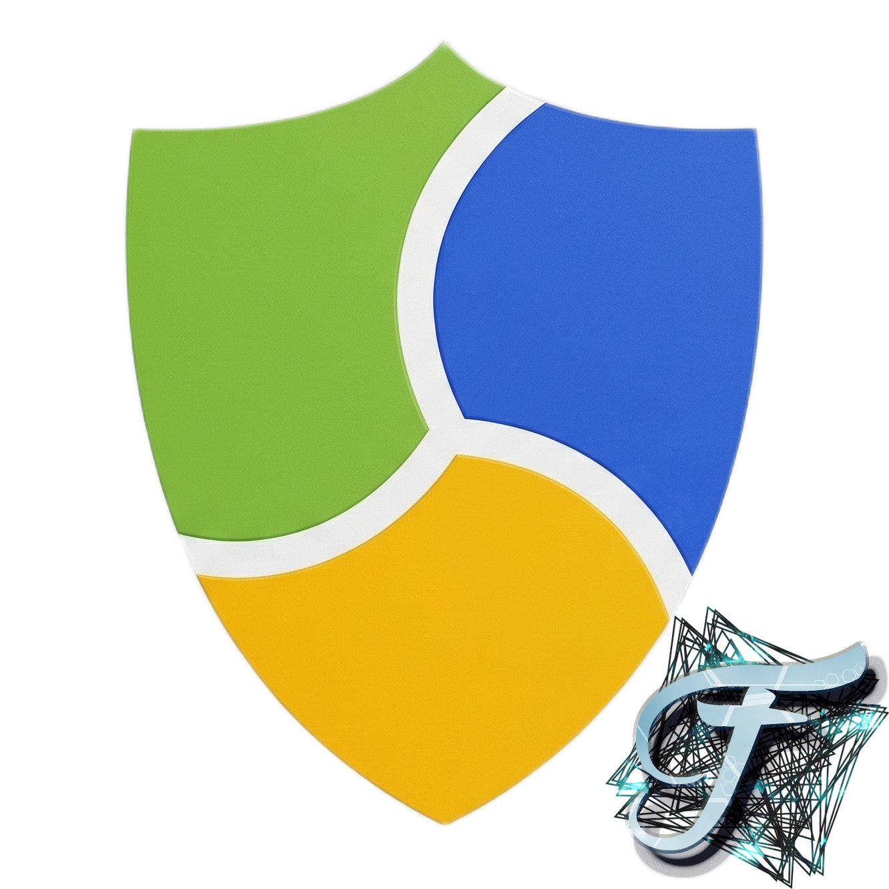
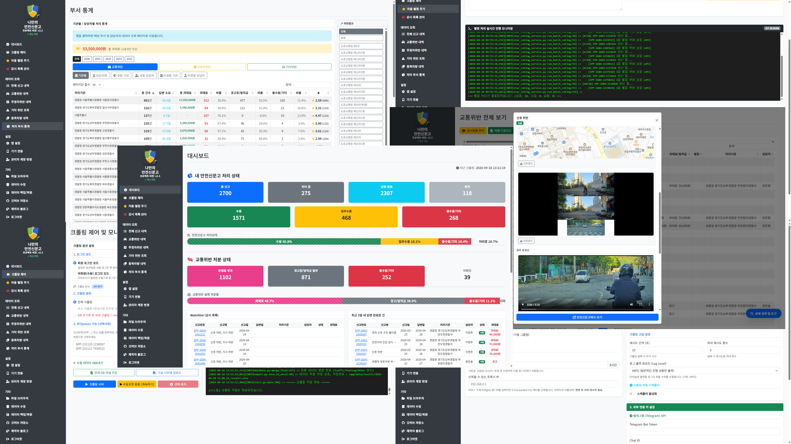

# 나만의 안전신문고 (MySafetyReport Manager)

<p align="center">
  
</p>

> 안전신문고에 신고한 내역을 자동으로 수집하고, 강력한 검색·통계·알림 기능을 제공하는 개인용 통합 관리 시스템입니다.
> 웹 대시보드, Android 앱, Chrome 확장 프로그램을 함께 사용할 수 있습니다.

<p align="center">
  
</p>


[](https://github.com/Fentanest/safetyreport/releases)
[](https://github.com/Fentanest/safetyreport/pkgs/container/safetyreport)
[](https://hub.docker.com/r/fentanest/safetyreport)

---

## 이런 분께 필요합니다

- 안전신문고 신고를 수십~수백 건씩 관리하는데 공식 웹사이트가 불편하신 분
- 과태료·범칙금 수용 현황을 기관별·담당자별로 통계로 보고 싶은 분
- 답변 내용 검색이 안되서 답답하신 분
- 신고가 처리될 때마다 만족도 조사를 일일이 제출하기 번거로우신 분
- 신고 데이터를 엑셀이나 구글 스프레드시트로 정리하고 싶은 분
- 처리 결과를 스마트폰 알림으로 바로 받고 싶은 분

---

## 주요 기능

### 자동 데이터 수집 (크롤링)
안전신문고에 로그인해 신고 목록과 상세 내용을 자동으로 가져옵니다.
수집되는 정보: 신고명, 신고번호, 신고일, 처리기관, 담당자, 처리상태, 과태료·범칙금·벌점, 신고내용, 처리내용, 첨부사진, 첨부파일

- **전체/증분 수집**: 처음엔 전체를 가져오고, 이후엔 변경된 내역만 빠르게 업데이트
- **자동 스케줄러**: 매일 특정 시각 또는 N시간마다 자동 실행
- **실시간 로그**: 크롤링 진행 상황을 화면에서 바로 확인

### 강력한 검색 및 필터
공식 사이트보다 훨씬 다양한 조건으로 신고 내역을 찾아볼 수 있습니다.

- 차량번호, 신고번호, 신고명, 위반법규, 담당자, 처리기관, 위반장소, 처리상태 **다중 조건 동시 검색**
- 신고일·발생일·답변일 **날짜 범위 필터**
- 경찰기관 포함/제외, 취하 데이터 숨기기
- 검색 결과만 엑셀로 내보내기, 신고번호 일괄 복사
- 첨부사진·동영상 팝업 인라인 미리보기 및 다운로드

### 통계 분석
내 신고를 어느 기관·담당자가 어떻게 처리했는지 한눈에 파악합니다.

- **대시보드**: 전체 신고 수, 처리상태별 현황, 교통위반 과태료·범칙금·불수용 요약
- **통계 탭**: 교통위반·주정차위반·기타위반 각각 기관별 / 담당자별 / 경찰기관 / 경찰담당자 / 비경찰기관 / 비경찰담당자 총 18가지 뷰
- 통계 항목 클릭 시 해당 기관·담당자의 신고 목록으로 바로 이동
- 최근 3일 내 답변 완료된 신고 목록 대시보드 표시

### 감시 목록 (Watchlist)
특별히 주시할 신고나 차량을 등록해 변경 사항을 빠르게 추적합니다.
감시 목록은 대시보드에서 바로 확인하고 상세 내용을 열어볼 수 있습니다.

### 자동 만족도 조사 (별점 매크로)
처리 완료된 신고들에 대해 만족도 조사를 자동으로 일괄 제출합니다.

- 별점(1-5점) 선택 후 수십-수백 건을 한 번에 처리
- 처리중·취하 등 조사 불가 항목은 자동 제외

### 내보내기
- **Excel**: 현재 검색 결과 또는 전체 데이터를 즉시 저장
- **구글 스프레드시트**: Google API 연동으로 클라우드에 자동 업로드 (크롤링 완료 시 자동 실행 가능)

### 텔레그램 봇 알림
- 크롤링 완료·오류 시 텔레그램으로 즉시 알림 (변경된 신고 건수 포함)
- 채팅창에서 명령어로 크롤링 시작·상태 조회 가능

---

## Android 앱 연동

서버를 운영 중이라면 안드로이드 앱을 함께 사용할 수 있습니다.

### 앱 주요 기능

| 탭 | 기능 |
|----|------|
| 대시보드 | 처리 현황 요약, 감시 목록, 최근 답변 신고 확인 |
| 신고리스트 | 교통위반·주정차위반·기타위반 목록 조회, 검색·필터, 상세 보기 |
| 통계 | 기관별·담당자별·경찰/비경찰 분류 통계 (18가지 뷰) |
| 알림 | 크롤링 현황 알림 / 개별 신고 처리 결과 알림 분리 표시 |
| 파일 | 서버의 로그·결과 파일 직접 확인 |
| 크롤링 | 크롤링 시작·중지 및 실시간 로그 확인 |

### 앱 알림 기능
- 앱이 완전히 꺼진 상태에서도 서버와 WebSocket 연결을 유지하며 **처리 결과 즉시 푸시 알림**
- 알림 탭에서 각 신고의 처리상태, 과태료·범칙금, 담당기관 등을 바로 확인
- 신고 알림 탭 항목을 탭하면 해당 신고의 상세 정보(신고내용·처리내용·첨부사진·동영상) 표시

### 신고 상세 화면
신고 항목을 탭하면 신고번호, 처리기관, 담당자, 신고내용, 처리내용, 첨부사진·동영상 인라인 표시까지 모두 확인할 수 있습니다.
**안전신문고 앱에서 보기** 버튼으로 공식 앱으로 바로 이동할 수도 있습니다.

### 앱 설치 방법
[Google Play 스토어](https://play.google.com/store/apps/details?id=com.fentanest.mysafetyreport)에서 설치할 수 있습니다.

앱 설치 후 **설정** 탭에서 서버 주소와 API 키를 입력하면 바로 연결됩니다.
API 키는 웹 관리 페이지의 **기기 연동** 메뉴에서 발급할 수 있습니다.

---

## Chrome 확장 프로그램 연동

[Chrome 웹 스토어](https://chromewebstore.google.com/detail/나만의-안전신문고/pfoigdedcddegilmjmgojohalkighpgh)에서 설치할 수 있습니다.

안전신문고 사이트를 브라우저에서 열어 신고 내역을 볼 때 차량번호를 클릭하면 수집된 데이터베이스에서 해당 차량의 이전 신고 이력을 바로 조회할 수 있습니다.

확장 프로그램 설정에서 서버 주소와 API 키를 입력하면 연결됩니다. API 키는 웹 관리 페이지의 **기기 연동** 메뉴에서 발급할 수 있습니다.

또한 크롤링이 완료되면 확장 프로그램에 알림이 표시되며, 변경된 신고 건수와 내역을 확인할 수 있습니다.

---

## 설치 및 시작 방법

### 방법 1. Docker (서버·NAS 환경 추천)

**사전 조건**: Docker 및 Docker Compose 설치 필요

두 가지 구성 중 환경에 맞는 것을 선택하세요.

---

#### 옵션 A. 기본 구성 (크로미움 내장, 간단 설치 추천)

Docker 이미지에 크로미움이 포함되어 있어 별도 설치 없이 바로 사용할 수 있습니다.

**Windows (PowerShell)**
```powershell
Invoke-WebRequest -Uri "https://raw.githubusercontent.com/Fentanest/safetyreport/main/docker-compose.yml" -OutFile "docker-compose.yml"
docker-compose up -d
```

**Linux / macOS**
```bash
curl -O https://raw.githubusercontent.com/Fentanest/safetyreport/main/docker-compose.yml
docker-compose up -d
```

브라우저에서 `http://서버IP:6819` 으로 접속합니다.

실행 후 설정 → 크롬 구동 방식을 **로컬 데스크톱 크롬**, **Headless 모드** 활성화로 설정하세요.

---

#### 옵션 B. Selenium Hub 포함 구성 (안정적인 크롤링이 필요한 경우)

Selenium Hub + Chrome 노드를 별도 컨테이너로 운영합니다.

**Windows (PowerShell)**
```powershell
Invoke-WebRequest -Uri "https://raw.githubusercontent.com/Fentanest/safetyreport/main/docker-compose-selenium-hub.yml" -OutFile "docker-compose.yml"
docker-compose up -d
```

**Linux / macOS**
```bash
curl -o docker-compose.yml https://raw.githubusercontent.com/Fentanest/safetyreport/main/docker-compose-selenium-hub.yml
docker-compose up -d
```

브라우저에서 `http://서버IP:6819` 으로 접속합니다.

실행 후 설정 → 크롬 구동 방식을 **Selenium Hub**, 주소를 `http://selenium-hub:4444/wd/hub` 로 설정하세요.

---

### 방법 2. Windows 실행 파일 (일반 PC 사용자 추천)

**사전 조건**: 크롬(Chrome) 브라우저 설치 필요

1. [릴리즈 페이지](https://github.com/Fentanest/safetyreport/releases)에서 최신 `mysafetyreport-win.zip` 다운로드
2. 압축 해제 후 `mysafetyreport.exe` 실행
3. 자동으로 브라우저가 열리며 웹 UI로 접속됩니다 (`http://127.0.0.1:6819`)
4. 설정 → 크롬 구동 방식을 **로컬 데스크톱 크롬**으로 선택

---

### 방법 3. Linux 실행 파일 (데비안/우분투 서버)

**사전 조건**: 크롬 또는 Selenium Hub 필요

1. [릴리즈 페이지](https://github.com/Fentanest/safetyreport/releases)에서 최신 `mysafetyreport-linux.zip` 다운로드
2. 압축 해제 후 실행 권한 부여 및 실행:
   ```bash
   chmod +x run.sh
   ./run.sh
   ```
3. 데스크톱 환경이면 브라우저가 자동으로 열립니다. 서버(헤드리스) 환경이면 `http://서버IP:6819` 로 직접 접속하세요.
4. 설정 → 크롬 구동 방식을 **로컬 데스크톱 크롬**으로 선택 (헤드리스일 경우 환경에 맞게 설정)

---

### 방법 4. macOS 실행 파일 (Intel / Apple Silicon)

**사전 조건**: 크롬(Chrome) 브라우저 설치 권장

1. [릴리즈 페이지](https://github.com/Fentanest/safetyreport/releases)에서 환경에 맞는 파일을 다운로드합니다.
   - Intel Mac: `mysafetyreport-macos-intel.zip`
   - Apple Silicon Mac: `mysafetyreport-macos-arm64.zip`
2. 압축 해제 후 실행 권한을 부여합니다:
   ```bash
   chmod +x run.command mysafetyreport
   ```
3. 실행:
   ```bash
   ./run.command
   ```
4. 처음 실행 시 macOS가 차단하면 Finder에서 `run.command` 또는 `mysafetyreport`를 우클릭해 **열기**를 선택하거나, 필요하면 아래 명령으로 quarantine 속성을 제거합니다:
   ```bash
   xattr -dr com.apple.quarantine .
   ```
5. 자동으로 브라우저가 열리며 웹 UI로 접속됩니다 (`http://127.0.0.1:6819`)
6. 설정 → 크롬 구동 방식을 **로컬 데스크톱 크롬**으로 선택

macOS 포터블 실행 파일도 데이터는 실행 폴더의 `data/` 아래에 저장되며, 자동 업데이트 시 이 폴더는 보존됩니다.

---

## 초기 설정

처음 접속하면 관리자 계정 생성 화면이 나타납니다. 아이디와 비밀번호를 설정하면 바로 사용할 수 있습니다.

이후 **설정** 메뉴에서 아래 항목들을 입력하세요.

| 항목 | 설명 |
|------|------|
| 안전신문고 아이디/비밀번호 | 크롤링에 사용할 안전신문고 로그인 계정 |
| 크롬 구동 방식 | 환경에 맞게 선택 (데스크톱 / Selenium Hub / 원격 디버깅) |
| Telegram Bot Token / Chat ID | 선택사항. 텔레그램 알림 사용 시 입력 |
| 구글 스프레드시트 URL | 선택사항. 구글 시트 연동 시 입력 |
| 휴대폰 번호 | 선택사항. 별점 매크로 사용 시 필수 |

---

## 자주 묻는 질문

**Q. 크롤링하면 안전신문고 계정이 차단되지 않나요?**
A. 기본 크롤링 방식은 안전신문고 공식 앱도 사용하는 API를 동일하게 호출하는 방식입니다. 화면을 직접 조작하지 않아 비교적 부하가 적습니다. 다만 과도하게 짧은 간격으로 반복 실행하는 것은 권장하지 않습니다.

**Q. 기존 데이터는 보존되나요?**
A. 모든 데이터는 `data/` 폴더의 SQLite 파일에 저장됩니다. Docker 환경에서는 볼륨 마운트(`./data:/app/data`)를 통해 컨테이너를 재시작하거나 업데이트해도 데이터가 유지됩니다.

**Q. Android 앱은 서버 없이 단독으로 사용할 수 있나요?**
A. 앱은 이 프로그램을 서버로 운영 중일 때만 사용할 수 있습니다. 앱 자체가 크롤링하거나 안전신문고에 직접 접근하지는 않습니다.

**Q. 구글 스프레드시트 연동은 어떻게 하나요?**
A. Google Cloud Console에서 서비스 계정을 생성하고 `Service Account JSON` 키 파일을 발급받아 설정 페이지에서 업로드하면 됩니다. 연동할 스프레드시트에 서비스 계정 이메일을 편집자로 공유해야 합니다.

**Q. 앱 알림이 오지 않아요.**
A. 앱 설정에서 WsService(백그라운드 연결)가 실행 중인지 확인하세요. Android 배터리 최적화 설정에서 이 앱을 예외로 등록하면 백그라운드 연결이 더 안정적으로 유지됩니다.

---

## 유관 프로젝트

| 프로젝트 | 설명 |
|----------|------|
| [safetyreport-mobile](https://github.com/Fentanest/safetyreport-mobile) | 이 서버와 연동하는 Android 앱 ([Google Play 스토어](https://play.google.com/store/apps/details?id=com.fentanest.mysafetyreport)) |
| [safetyreport-chromeextension](https://github.com/Fentanest/safetyreport-chromeextension) | 차량번호 조회 등 브라우저 연동 크롬 확장 프로그램 ([Chrome 웹 스토어](https://chromewebstore.google.com/detail/나만의-안전신문고/pfoigdedcddegilmjmgojohalkighpgh)) |

---

## 면책 조항

본 프로그램은 개인적인 데이터 관리 및 분석을 위한 도구입니다. 안전신문고 서비스 이용 약관을 준수하여 사용하시기 바라며, 과도한 요청으로 인한 서비스 제한 등 모든 사용 결과에 대한 책임은 사용자 본인에게 있습니다.
