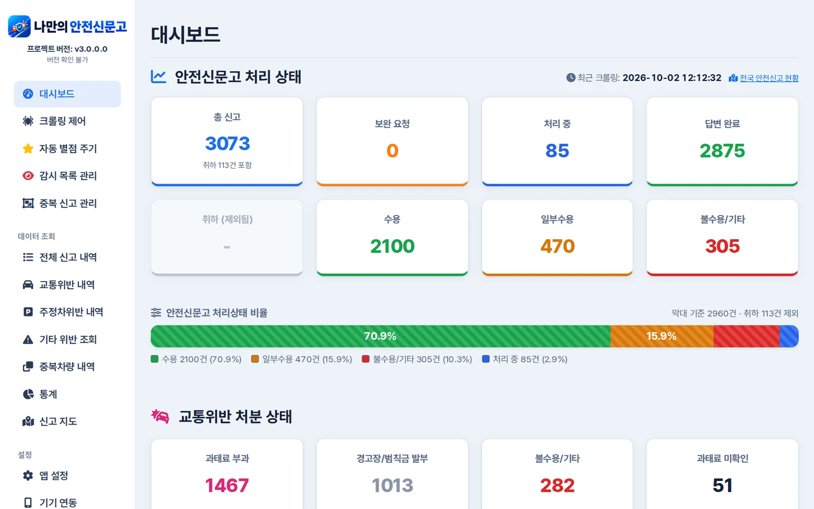
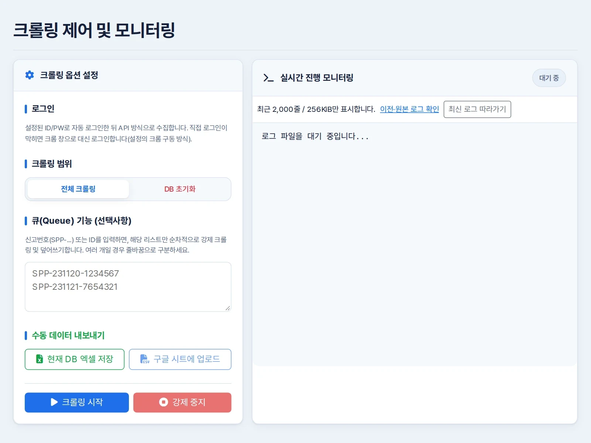
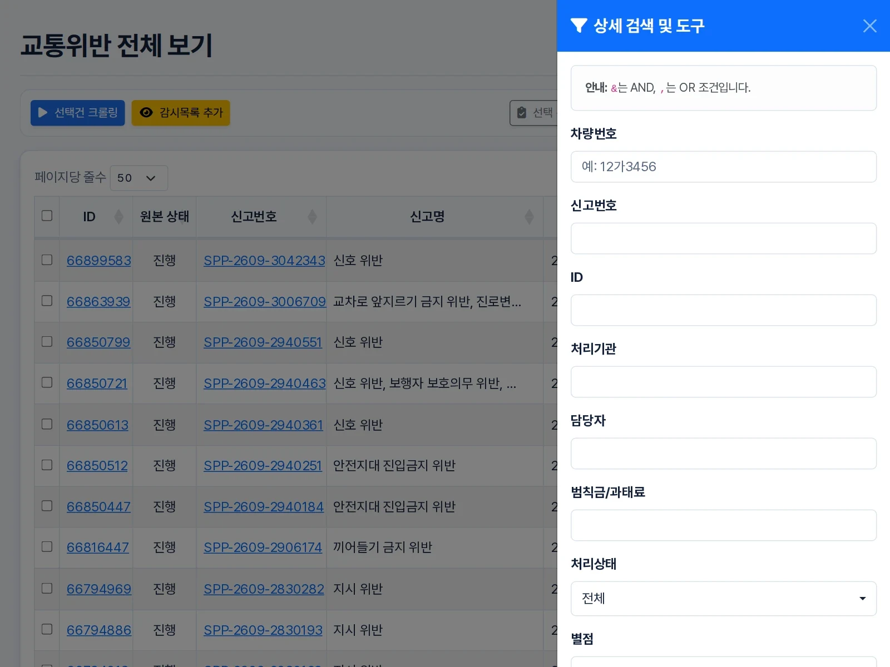
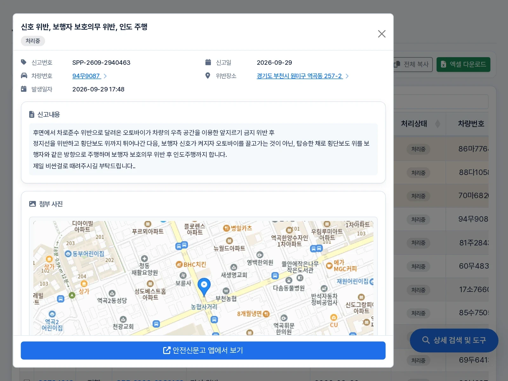
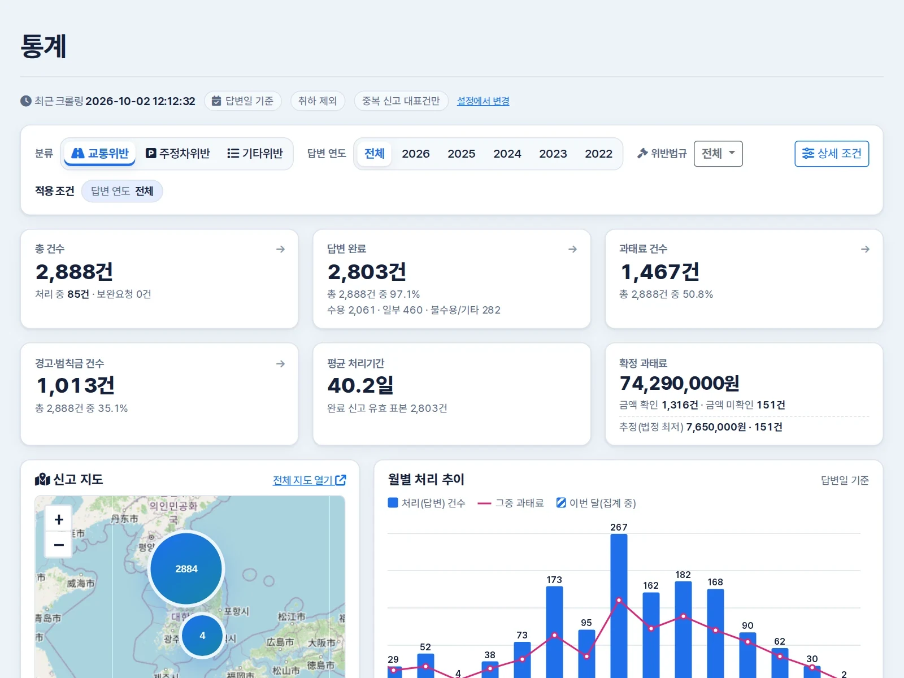
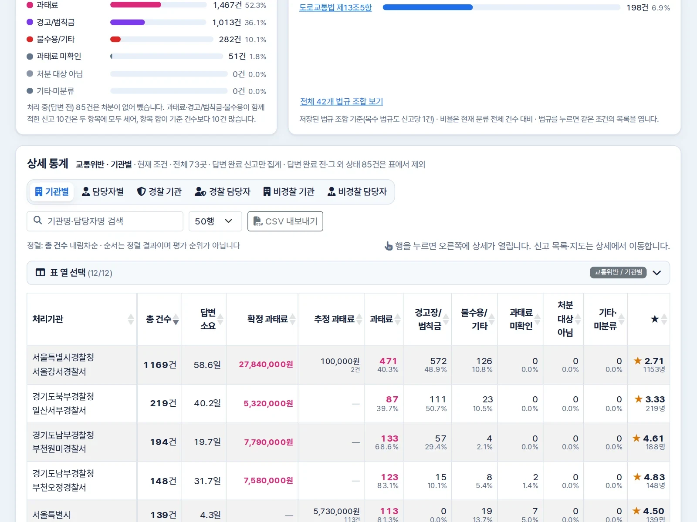
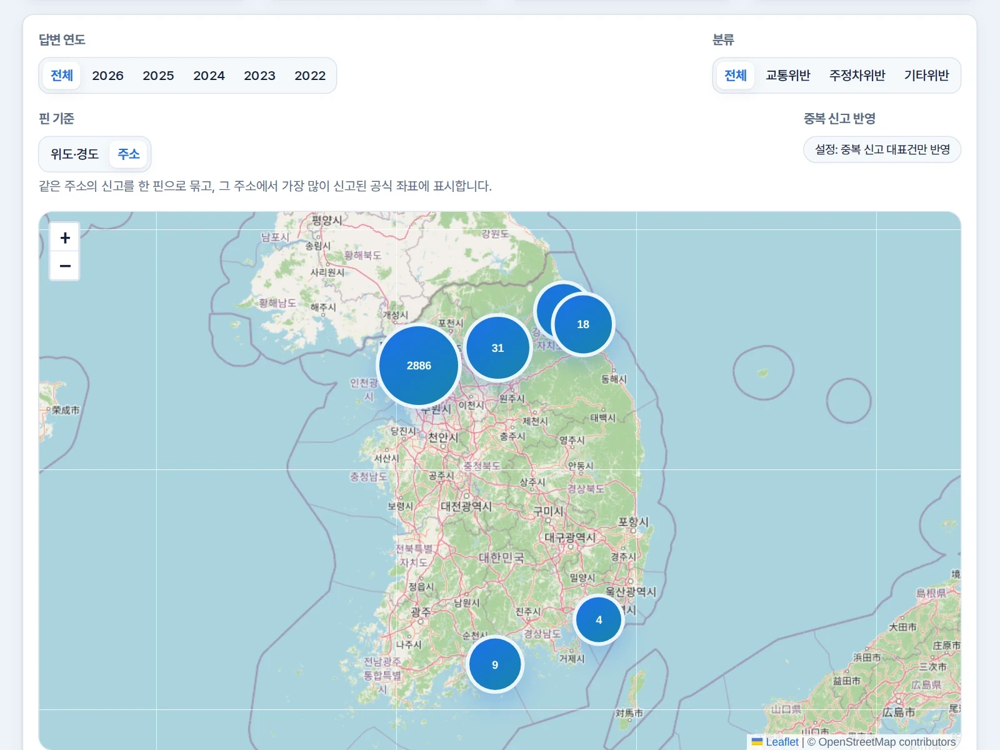
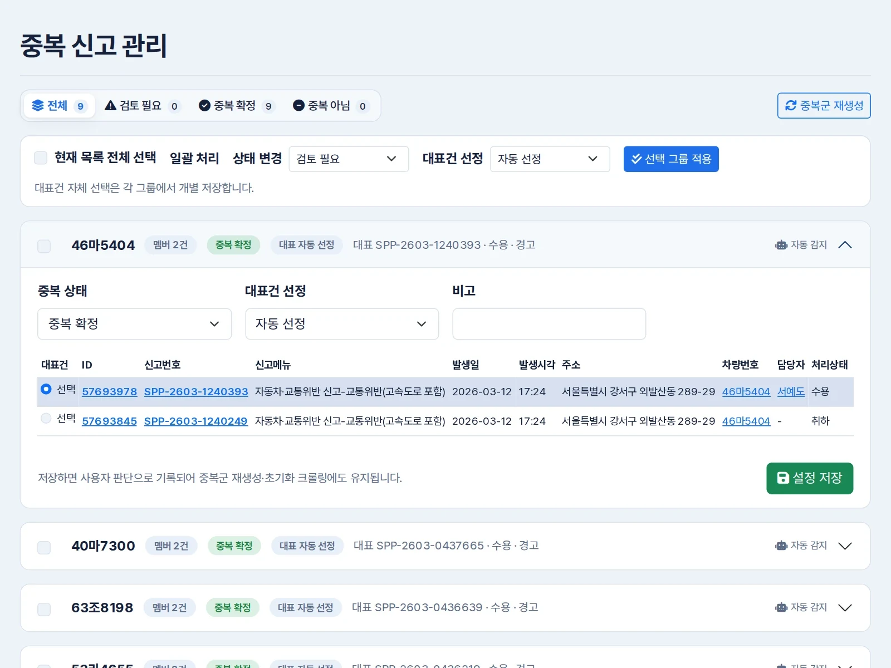
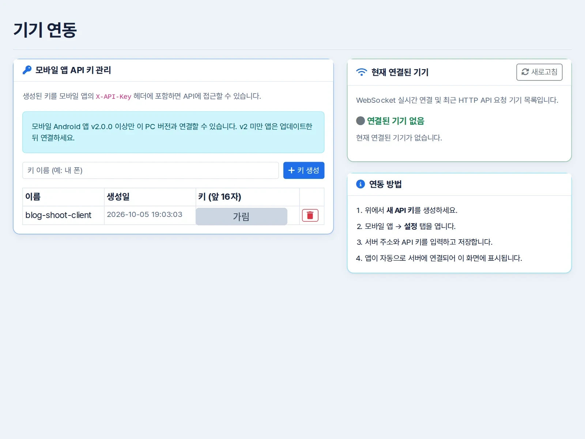
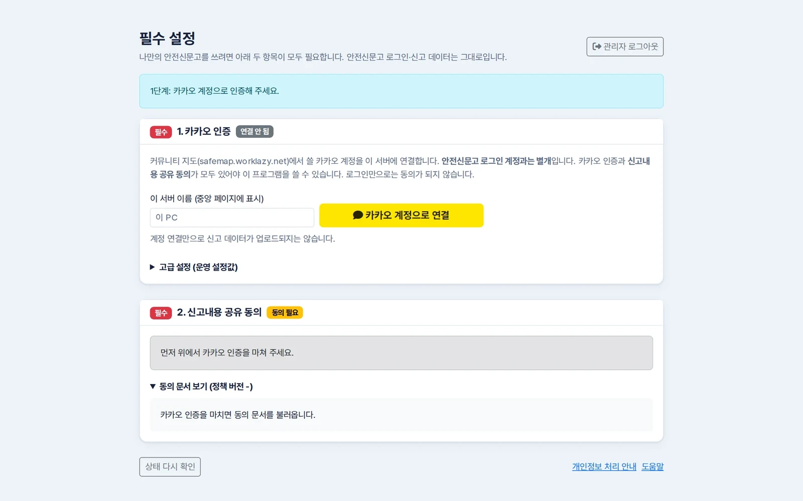

# 나만의 안전신문고 (MySafetyReport Manager)

<p align="center">
  
</p>

> 안전신문고에 이미 접수한 내 신고를 모아서 처리 결과를 검색하고, 통계와 지도로 확인하는 개인용 프로그램입니다.
> 이 프로그램에서 새 신고를 접수할 수는 없습니다. 안전신문고 공식 서비스가 아니며, 원문 확인과 민원 처리는 안전신문고 공식 앱·웹에서 합니다.
> PC(웹 화면)로 쓰고, Android 앱과 Chrome 확장 프로그램을 연결할 수 있습니다.

<p align="center">
  
</p>

[](https://github.com/Fentanest/safetyreport/releases)
[](https://github.com/Fentanest/safetyreport/pkgs/container/safetyreport)
[](https://hub.docker.com/r/fentanest/safetyreport)

📖 **화면별 자세한 사용법**: [나만의 안전신문고 PC·Android 사용 안내](https://hb.worklazy.net/mysafetyreport-pc-android-guide/)

> **버전 안내** — 이 README와 사진은 다음 버전(저장소 표기 `3.0.0.0`, 아직 정식 배포 전) 기준입니다.
> 지금 [릴리즈 페이지](https://github.com/Fentanest/safetyreport/releases)에서 받을 수 있는 v2.5.x에는 카카오 인증·신고내용 공유 동의, 신고 지도·커뮤니티 공유가 없고 화면도 다릅니다.

---

## 이런 분께 필요합니다

- 안전신문고 신고를 수십~수백 건씩 관리하는데 공식 웹사이트에서는 한 건씩 열어 봐야 해서 불편하신 분
- 과태료·경고·불수용 결과를 기관별·담당자별로 모아 보고 싶은 분
- 답변 내용(처리내용)까지 검색하고 싶은 분
- 처리된 신고의 만족도 조사를 한꺼번에 제출하고 싶은 분
- 신고 데이터를 파일이나 구글 스프레드시트로 정리하고 싶은 분

---

## 먼저 알아 둘 것 — 계정 세 가지

| 계정 | 어디서 쓰나 | 설명 |
|---|---|---|
| **관리자 계정** | 이 프로그램의 웹 화면 로그인 | 처음 실행할 때 직접 만듭니다. 안전신문고 계정과 관계없습니다. |
| **안전신문고 계정** | 신고 수집(크롤링) | `앱 설정`에 아이디·비밀번호를 넣습니다. 휴대폰 번호는 만족도(별점) 제출에 씁니다. |
| **카카오 계정** | 필수 인증, 커뮤니티 지도 | 이 버전부터 **카카오 인증과 신고내용 공유 동의를 마쳐야** 화면을 쓸 수 있습니다. 이 계정이 신고 자료의 주인으로 기록됩니다. |

- 카카오 인증만으로는 업로드되지 않습니다. **신고내용 공유 동의**를 하면 답변이 끝난 신고 일부 항목(주소, 처리기관, 담당자명, 차량번호, 위반법규, 처리 결과·처분, 확정 금액, 좌표, 별점 등)이 커뮤니티 지도 서버로 공유됩니다. 직접 수정한 값은 공유하지 않습니다.
- **카카오 로그아웃을 하면 이 서버의 신고 내역이 지워집니다.** 사이드바 맨 아래의 `로그아웃`은 관리자 화면 로그아웃이라 자료를 지우지 않습니다.

---

## 주요 기능

### 신고 수집
안전신문고에 로그인해 신고 목록과 상세 내용(처리기관, 담당자, 처리상태, 과태료·범칙금·벌점, 신고내용, 처리내용, 첨부)을 가져옵니다.
기본은 안전신문고에 직접 로그인하는 방식이고, 막힐 때만 크롬(Selenium Hub / 로컬 데스크톱 크롬 / 원격 디버깅 크롬)을 씁니다.

- `크롤링 제어`: 전체 크롤링, 큐(신고번호를 줄마다 넣어 그 신고만 다시 수집), 강제 중지, 실시간 로그
- `앱 설정 > 크롤링 자동 스케줄러`: 일정 간격 또는 지정한 시각(최대 10개)에 자동 수집
- 처음 한 번은 공유용 사본을 만드는 **초기화 크롤링**이 필요합니다(시작 전 자동 백업)

<p align="center"></p>

### 대시보드와 신고내역
- 대시보드: 처리 상태 카드(누르면 그 상태의 목록으로), 교통위반 처분 상태(과태료 부과·경고장/범칙금 발부·불수용/기타·과태료 미확인), 감시 목록, 최근 3일 내 답변 완료
- 신고내역: 전체·교통위반·주정차위반·기타 위반·중복차량. 오른쪽 아래 `상세 검색 및 도구`에서 차량번호·처리기관·담당자·처리상태·위반법규·신고내용·처리내용, 신고일·발생일·답변일 기간, 경찰기관 제외/만 등으로 거릅니다(`&`는 그리고, `,`는 또는)
- 체크한 신고의 번호 복사, 검색 결과 CSV 내려받기(버튼 이름은 `엑셀 다운로드`), 선택건 다시 수집, 감시목록 추가
- 신고번호를 누르면 상세 창: 처리내용, 보완 요청 이력, 첨부 사진·동영상, `안전신문고 앱에서 보기`

<p align="center"></p>
<p align="center"></p>

### 통계
분류·답변 연도·위반법규·상세 조건으로 요약 카드(총 건수, 답변 완료, 과태료 건수, 경고·범칙금 건수, 평균 처리기간, 확정 과태료), 월별 처리 추이, 처리결과·처분 분포, 위반법규별 현황, 상세 통계 표를 봅니다.
상세 통계는 기관별·담당자별·경찰/비경찰 기관·담당자 6가지로 보고, 행을 누르면 해당 신고 목록과 지도로 이어집니다.

- `처리상태`(수용·일부수용·불수용 등)와 `처분`(과태료·경고 등)은 다른 기준입니다. 수용이 곧 과태료는 아닙니다.
- 답변에 적힌 **확정** 과태료와 규칙으로 계산한 **추정** 과태료는 따로 표시합니다.
- 맨 아래 `전국 안전신고 현황`은 안전신문고 공개 통계로, 내 신고 통계와 다른 자료입니다.

<p align="center"></p>
<p align="center"></p>

### 신고 지도와 커뮤니티 지도
안전신문고 답변에 들어 있는 공식 좌표로 신고 위치를 지도에 표시합니다(주소를 외부 서비스로 좌표 변환하지 않습니다).
`핀 기준`을 `주소`로 바꾸면 같은 주소의 신고를 한 핀으로 모아 보여 줍니다. 공유 동의를 했다면 `커뮤니티 공유` 패널에서 업로드 상태를 보고, 제목 줄의 `커뮤니티 지도`로 [safemap.worklazy.net](https://safemap.worklazy.net/)을 엽니다.

<p align="center"></p>

### 신고 관리
- **감시 목록**: 지켜볼 신고번호를 모아 대시보드에서 바로 봅니다(변경 알림을 따로 보내는 기능은 아닙니다).
- **중복 신고 관리**: 같은 내용으로 여러 번 접수된 신고를 묶어 `검토 필요 / 중복 확정 / 중복 아님`과 대표건을 정합니다. `중복차량 내역`(같은 차량번호 2건 이상)과는 다른 기준입니다.
- **데이터 수정**: 신고 값을 내 기준으로 고쳐 봅니다. 원본 값이 함께 보이고, 다시 수집해도 유지되며, 공유되지 않습니다.
- **자동 별점 주기**: 만족도 조사 대상에 별점(1~5)과 공통 사유를 한꺼번에 제출합니다. 처리 중·취하 등은 자동으로 빠지고, **제출한 별점은 되돌릴 수 없습니다.**

<p align="center"></p>

### 알림·내보내기·백업
- 텔레그램 봇 알림과 채팅 명령(크롤링 시작, 차량·신고번호 검색 등), 구글 스프레드시트 업로드, `크롤링 제어`의 현재 DB 엑셀(xlsx) 저장
- `데이터 백업/복원`: DB 내려받기와 복원. Android 앱의 DB도 서버 형식으로 바꿔 복원합니다. 복원 직전 DB는 `data/backups/`에 자동 보관됩니다. 다른 카카오 계정의 자료는 복원할 수 없습니다.
- `파일 브라우저`(결과·로그 파일), `관리자 계정 변경`, 화면 테마(시스템/라이트/다크)

---

## Android 앱·Chrome 확장 프로그램 연결

<p align="center"></p>

- **Android 앱**([Google Play](https://play.google.com/store/apps/details?id=com.fentanest.mysafetyreport)): 앱의 **Client 모드**에서 이 서버 주소와 API 키를 넣으면 서버의 자료로 앱을 씁니다. API 키는 `기기 연동`에서 만듭니다(한 번만 표시). 이 버전의 서버에는 **Android 앱 2.0 이상**이 연결됩니다.
  - 앱에서 서버의 커뮤니티(카카오) 연결을 확인·관리하려면 `앱 설정 > 4. 커뮤니티 계정 > 모바일 앱의 커뮤니티 계정 관리 권한`에서 그 키를 체크하세요.
  - 앱은 서버 없이 **Standalone 모드**로도 씁니다. 두 방식 모두 카카오 인증과 공유 동의가 필요합니다. 자세한 내용은 [앱 저장소](https://github.com/Fentanest/safetyreport-mobile)를 보세요.
  - 같은 카카오 계정이어도 PC와 앱 자료가 저절로 맞춰지지는 않습니다. Client 모드로 연결하거나, `DB 다운로드` 파일을 앱의 `DB 복원`으로 옮깁니다.
- **Chrome 확장 프로그램**([Chrome 웹 스토어](https://chromewebstore.google.com/detail/나만의-안전신문고/pfoigdedcddegilmjmgojohalkighpgh)): 안전신문고 사이트에서 차량번호·주소로 수집한 자료를 바로 조회합니다. 확장 프로그램 설정에 서버 주소와 API 키를 넣습니다.

---

## 설치 및 시작 방법

### 방법 1. Docker (서버·NAS 환경 추천)

**사전 조건**: Docker 및 Docker Compose 설치 필요. 두 가지 구성 중 환경에 맞는 것을 고르세요.

#### 옵션 A. 기본 구성 (크로미움 내장, 간단 설치 추천)

**Windows (PowerShell)**
```powershell
Invoke-WebRequest -Uri "https://raw.githubusercontent.com/Fentanest/safetyreport/main/docker-compose.yml" -OutFile "docker-compose.yml"
docker-compose up -d
```

**Linux / macOS**
```bash
curl -O https://raw.githubusercontent.com/Fentanest/safetyreport/main/docker-compose.yml
docker-compose up -d
```

브라우저에서 `http://서버IP:6819` 로 접속합니다. 크롬이 필요할 때를 대비해 `앱 설정 > 크롬 구동 방식`을 **로컬 데스크톱 크롬**, **Headless 모드** 켬으로 두세요.

#### 옵션 B. Selenium Hub 포함 구성

**Windows (PowerShell)**
```powershell
Invoke-WebRequest -Uri "https://raw.githubusercontent.com/Fentanest/safetyreport/main/docker-compose-selenium-hub.yml" -OutFile "docker-compose.yml"
docker-compose up -d
```

**Linux / macOS**
```bash
curl -o docker-compose.yml https://raw.githubusercontent.com/Fentanest/safetyreport/main/docker-compose-selenium-hub.yml
docker-compose up -d
```

`앱 설정 > 크롬 구동 방식`을 **Selenium Hub**, 주소를 `http://selenium-hub:4444/wd/hub` 로 설정하세요.

Docker 데이터는 `./data:/app/data` 연결을 유지해야 재시작해도 남습니다.

### 방법 2. Windows 실행 파일

1. [릴리즈 페이지](https://github.com/Fentanest/safetyreport/releases)에서 `mysafetyreport-win.zip` 다운로드
2. 압축 해제 후 `mysafetyreport.exe` 실행 → 브라우저가 `http://127.0.0.1:6819` 로 열립니다
3. 크롬(Chrome) 브라우저가 설치되어 있으면 크롬이 필요할 때 씁니다(`앱 설정 > 크롬 구동 방식 > 로컬 데스크톱 크롬`)

### 방법 3. Linux 실행 파일 (데비안/우분투)

1. [릴리즈 페이지](https://github.com/Fentanest/safetyreport/releases)에서 `mysafetyreport-linux.zip` 다운로드
2. 압축 해제 후 실행:
   ```bash
   chmod +x run.sh
   ./run.sh
   ```
3. 데스크톱이면 브라우저가 자동으로 열리고, 서버(화면 없음) 환경이면 `http://서버IP:6819` 로 접속합니다.

### 방법 4. macOS 실행 파일 (Intel / Apple Silicon)

1. [릴리즈 페이지](https://github.com/Fentanest/safetyreport/releases)에서 Intel은 `mysafetyreport-macos-x64.zip`, Apple Silicon은 `mysafetyreport-macos-arm64.zip`
2. 압축 해제 후 `chmod +x run.command mysafetyreport`, Finder에서 `run.command` 실행
3. macOS가 막으면 `run.command`를 우클릭해 **열기**, 또는 `시스템 설정 > 개인정보 보호 및 보안`에서 **그래도 열기**. 안쪽 파일이 계속 막히면 압축을 푼 폴더에서:
   ```bash
   xattr -dr com.apple.quarantine .
   chmod +x run.command mysafetyreport
   ./run.command
   ```

실행 파일 버전은 데이터를 실행 폴더의 `data/`에 저장하고, 시작할 때 새 버전이 있으면 콘솔에서 업데이트할지 묻습니다(업데이트 때 `data/`는 보존).

---

## 처음 설정

1. 처음 접속하면 **관리자 계정**(아이디, 비밀번호 4자 이상)을 만들고 로그인합니다.
2. **필수 설정**: `카카오 계정으로 연결` → 신고내용 공유 동의. 두 단계를 마쳐야 다른 화면으로 넘어갑니다.
3. `앱 설정 > 1. 시스템 및 서버 설정`에 안전신문고 아이디·비밀번호(별점을 쓰려면 휴대폰 번호도)를 넣고 저장합니다.
4. 안내가 나오면 **초기화 크롤링**을 한 번 진행합니다. 그다음부터 `크롤링 제어`나 자동 스케줄러로 수집합니다.

<p align="center"></p>

| 앱 설정 항목 | 설명 |
|------|------|
| 안전신문고 아이디/비밀번호 | 수집에 쓰는 안전신문고 로그인 계정(비밀번호는 암호화 저장) |
| 휴대폰 번호 | 자동 별점 주기에 필요 |
| 취하 데이터 숨기기 / 중복 신고 대표건만 반영 | 목록·통계에 함께 적용(기본 켬) |
| 크롬 구동 방식 | 직접 로그인이 막혔을 때 쓸 크롬(데스크톱 / Selenium Hub / 원격 디버깅) |
| 크롤링 자동 스케줄러 | 주기 또는 지정 시각 자동 수집 |
| Telegram Bot Token / Chat ID | 선택. 텔레그램 알림 |
| Sheet URL·ID, 구글 연동 JSON | 선택. 구글 스프레드시트 연동(서비스 계정 JSON) |

---

## 자주 묻는 질문

**Q. 크롤링하면 안전신문고 계정이 차단되지 않나요?**
A. 기본 수집 방식은 안전신문고에 직접 로그인해 공식 앱과 같은 API를 부르는 방식이라 화면을 조작하지 않습니다. 다만 너무 짧은 간격으로 반복 실행하는 것은 권하지 않습니다.

**Q. 기존 데이터는 보존되나요? (v2.x에서 업데이트)**
A. 이전 형식의 자료가 있으면 서버가 먼저 `data/backups/`에 백업하고 신고 내역을 비운 뒤 초기화 크롤링으로 다시 수집합니다. 감시목록은 남지만, 직접 수정한 값·중복 신고 판단은 옮겨지지 않습니다. 업데이트 전에 `데이터 백업/복원`으로 따로 백업해 두세요.

**Q. 카카오 로그아웃을 했더니 신고 내역이 없어졌어요.**
A. 카카오 로그아웃은 이 서버의 신고 내역을 지웁니다(관리자 계정·API 키·감시목록은 남음). 같은 카카오 계정으로 다시 연결한 뒤 수집하거나, 미리 받아 둔 DB 파일을 복원하세요.

**Q. Android 앱은 서버 없이 쓸 수 있나요?**
A. 앱의 **Standalone 모드**를 고르면 PC 없이 안전신문고 계정으로 직접 가져옵니다. 서버가 켜져 있을 때의 자동 수집·파일 관리·Chrome 확장 연결은 **Client 모드**에서 씁니다.

**Q. 구글 스프레드시트 연동은 어떻게 하나요?**
A. Google Cloud Console에서 서비스 계정을 만들고 JSON 키를 받아 `앱 설정 > 3. 외부 연동 키 설정`에 올립니다. 연결할 스프레드시트를 서비스 계정 이메일과 편집자로 공유해야 합니다.

**Q. 앱 알림이 오지 않아요.**
A. 앱의 `백그라운드 서버 연결`과 알림 권한, 배터리 최적화 제외를 확인하세요. 서버(3.0 이상)가 켜져 있고 앱에서 카카오 인증·동의를 마쳤는지도 확인해 주세요.

---

## 유관 프로젝트

| 프로젝트 | 설명 |
|----------|------|
| [safetyreport-mobile](https://github.com/Fentanest/safetyreport-mobile) | Android 앱 ([Google Play](https://play.google.com/store/apps/details?id=com.fentanest.mysafetyreport)) |
| [safetyreport-chromeextension](https://github.com/Fentanest/safetyreport-chromeextension) | 차량번호 조회 등 브라우저 연동 크롬 확장 프로그램 ([Chrome 웹 스토어](https://chromewebstore.google.com/detail/나만의-안전신문고/pfoigdedcddegilmjmgojohalkighpgh)) |
| [커뮤니티 지도](https://safemap.worklazy.net/) | 공유 동의한 사용자들의 신고를 모아 보는 지도 |

개발·빌드·테스트 안내는 [`AGENTS.md`](AGENTS.md)와 [`docs/development/`](docs/development/)에 있습니다.

---

## 면책 조항

본 프로그램은 개인적인 데이터 관리 및 분석을 위한 도구입니다. 안전신문고 서비스 이용 약관을 준수하여 사용하시기 바라며, 과도한 요청으로 인한 서비스 제한 등 모든 사용 결과에 대한 책임은 사용자 본인에게 있습니다.
