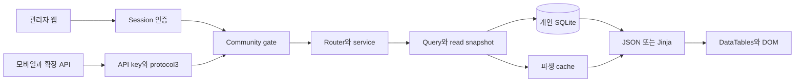

# Safetyreport dev 리팩터링 실행 계획

기존 기능과 데이터 의미를 보존하면서 데이터 보호, 실패 판정, 작업 충돌, 조회 비용, 화면 지연을 순서대로 개선한다. 이 문서는 `safetyreport_dev_refactoring_plan_prompt_ko.md`의 계획 작성 지시에 따른 구현 전 산출물이다. 제품 코드 변경과 운영 변경은 포함하지 않는다. 아래 설계는 현재 코드에서 다시 확인한 경로를 기준으로 하며, 실험하지 않은 사용자 환경의 장애를 확정하지 않는다.

## 1 핵심 결론

첫 다섯 변경은 다음과 같이 나눈다. 각각 별도 변경으로 검토하고 데이터 보호 수정을 성능 변경과 섞지 않는다.

1. `file_service`의 웹·API·목록·삭제·ZIP 경로를 하나의 정확한 허용 루트 검사로 묶는다. `logs/../auth`와 `logs-other` 같은 경계 이탈, 외부를 가리키는 symlink, 현재 사용 중인 로그의 다른 경로 표기를 차단한다. 합성 파일만 사용한다.
2. `duplicate_group_service._safe_read`의 예외를 빈 자료로 바꾸는 처리를 제거한다. 필수 원천을 모두 읽은 뒤에만 재생성하며 실패하면 기존 그룹·멤버·판단을 보존한다. 정상 빈 DB와 조회 실패는 다른 결과다.
3. Telegram의 모든 진입점에 호출자 검사를 붙이고 봇의 직접 crawler subprocess 실행을 없앤다. 허가된 검색·내보내기는 유지하고 크롤링은 서버의 공통 admission을 통과하게 한다. 별도 프로세스 사이의 잠금은 서버의 Python singleton만으로 해결되지 않는다.
4. 첨부 URL과 연결 기기 문자열을 안전한 DOM 생성으로 렌더하고 HTTP 상태와 의미적 성공을 구분한다. 설정 인증 파일 업로드 실패를 성공으로 안내하는 경로도 바로잡는다.
5. 중복군 bulk API 등록 순서와 JSON 입력 오류를 독립 수정하고, 새 작업의 60초 게이트 freshness가 실패할 때 오래된 탐색 캐시로 허용되지 않도록 한다.

다음 단계는 실패 크롤을 성공으로 기록하는 경로, 감시 스레드 등록 경쟁, 미디어 잠금과 준비 상태를 고정하는 것이다. 정확성 이후에는 통계의 신고별 계산을 한 번 수행해 여러 표에 재사용하고, 감시목록·ID 해석의 전체 조회를 필요한 대상 조회로 바꾼다. 사용자는 실패 원인을 확인할 수 있고, 재시도 때 자료를 잃거나 같은 외부 작업을 중복 수행하는 위험이 줄어든다. 실제 지연 개선 폭은 기준선 측정 이후 판단한다.

큰 위험은 DB 교환 의미 변경, raw/canonical 모집단 변경, 작업 종료와 새 실행의 경쟁, 캐시 무효화 누락, 화면 선택·CSV 모집단의 축소다. React/Next 전환, DB 엔진 교체, Redis/외부 작업큐, 제품 Node 런타임 추가, 전체 파일 이동은 기본 해법으로 채택하지 않는다. 기존 FastAPI/Jinja/Bootstrap/DataTables와 SQLite·source/frozen/Docker 제공 형태를 유지한다.

## 2 기준과 증거 범위

| 항목 | 확인값과 한계 |
|---|---|
| 기준 SHA | `2eb833d8b748b8b3bb94e254e680739b06f362fd` |
| 검토 기준 코드 HEAD | 기준 SHA와 같음. 감사 시작 시 커밋 사이 변경 없음. 후속 계획 문서 커밋은 제품 코드 변경과 구분 |
| 작업트리 | 사용자 `VERSION` 수정 및 기존 미추적 문서·issue·zip·testresults·DB 회귀 테스트·preview config가 존재. 이 계획의 변경과 분리 |
| 추적 파일 | 396개. Python 181, HTML 24, TS 23, JS 7, CSS 8개. 추적 파일과 디렉터리 포함 tree 항목 수를 혼동하지 않음 |
| Python 구조 조사 | 181개 AST 파싱 성공. 구문·함수/클래스 위치 조사이며 모든 함수 본문 심층 감사가 아님 |
| 심층 검토 D | 21개. 파일 전체 읽기와 관련 경계 검토; 모든 분기 실행 검증 아님 |
| 집중 검토 F | 32개. 발견 관련 함수·구간 검토, 나머지 구조 수준 |
| 테스트 본문 T | 4개. 실제 assertion 확인 |
| 계약·문서 C | 20개. 현행 관련 절 검토, 과거 기록과 법령 전체 재검증 아님 |
| 구조만 S | 132개. AST 수준 |
| 본문 미검토 N | 167개. 경로 확인만. 후속 구현 시 관련 파일을 추가 검토해야 함 |
| 생성자료·자산 X | 20개. 생성 registry 데이터·이미지·잠금파일은 줄별 감사 대상에서 제외 |
| 로컬 기준선 | Python 3.14.6, SQLite 3.45.1, pandas 3.0.1, SQLAlchemy 2.0.48, Jinja2 3.1.6, FastAPI 0.141.1, Starlette 1.7.0, requests 2.34.2, uvicorn 0.53.0, Linux x86_64 |
| Python 테스트 | 격리 데이터 루트·fixture 모드에서 전체 discover 573개, 568 passed/5 skipped, 138.954초. 실행 당시 작업트리의 기존 미추적 테스트도 discover 범위에 포함될 수 있음 |
| 이번에 실행하지 않은 검증 | 브라우저·Docker·frozen·Windows/macOS·모바일 왕복·계산 동등성·실제 외부 서비스·사용자 DB·성능 benchmark |

전체 파일별 수준은 [검토 범위 CSV](dev-refactoring-review-scope-2026-10-03.csv)에 있다. 등급은 원래 프롬프트의 감사 등급을 복사하지 않고 이번 검토 범위만 기록했다. 전체 unittest 통과는 이 문서의 신규 실패 주입 시나리오 통과를 뜻하지 않는다. 5 skipped를 passed에 포함하지 않는다.

임시 원자료는 `.agent-runs/refactor-audit/`의 `baseline.log`, `tracked-tree.json`, `python-structure.json`, `web-contract-inventory.json`에 있다. 추적 제외이며 개인 본문·자격증명을 측정값에 넣지 않는다. 외부 공격이나 운영 침해 실험은 하지 않았다. 프롬프트 부록의 개인 DB read-only 수치와 이전 검수의 성능·브라우저 통과는 과거 증거다. 이번 before/after로 사용하지 않는다.

## 3 현재 아키텍처와 경계

### 요청 처리

`main.py`는 여러 router를 import하면서 설정 singleton, 로그, 엔진, 세션 관련 파일을 준비한다. lifespan에서는 legacy DB 처리·현행 스키마 확인·maintenance·scheduler·Sunwi·community auth/gate/uploader·media cleanup·keepalive·bot을 시작하고 종료 시 일부 worker를 정지한다. `--mode`가 bot/crawl/notify/save_excel인 frozen 실행도 같은 진입 파일의 선행 import 영향이 있다. 별도 앱 factory를 도입하기 전에 이 부작용을 특성화해야 한다.

웹 요청은 관리자 session 인증 → community gate → router → service/query → SQLAlchemy/SQLite → Jinja 또는 JSON → JS/DataTables/DOM으로 진행한다. API는 유효 API key → protocol3 → community gate → route dependency 순서의 경계를 유지한다. 인증된 `/api/v1/server/version` 최소 probe만 protocol 예외다. 관리자 쿠키로 API 키/protocol을 대체하지 않는다. WebSocket은 별도의 인증·protocol·gate 검사와 4001/4403/4406 종료 의미를 갖는다.

일반 `def` route는 FastAPI threadpool에서 실행된다. `async def` 안의 동기 함수를 호출한다고 threadpool로 자동 이동하지 않는다. `version_latest`의 동기 GitHub 조회, rebuild/upload API의 `_verify_client_user_token`은 이 경계를 다시 검증할 대상이다. gate middleware와 많은 service 호출은 이미 `run_in_threadpool`을 사용한다.

목록은 `web/routers/data.py` → `data_service`의 façade → `report_query_service` → merge/감시목록/중복 projection → 전체 records JSON → `data_table.html`의 DataTables·검색·선택·복사·CSV다. 기존 전체 API는 전체 컬럼·NULL·정수 값을 보존하며, 추가 page API는 count와 page를 한 read transaction에서 읽고 같은 projection map을 사용한다.

통계는 `/stats` shell과 `/stats/content` → `get_stats_page` → `_load_stats_frames` 한 번 → `_compute_agency_stats` 및 overview → fragment HTML/JSON → `stats-loader.js`/`stats.js`다. 지도는 별도 full/bounded/viewport 조회 → 공간 집계 → Leaflet이다. 이미 공유하는 overview/table 읽기를 별도 호출로 되돌리지 않는다.

### 수집과 공유

웹·모바일·scheduler는 `crawl_control`의 gate/rebuild 검사와 `CrawlManager.start_crawl`의 예약·복원 세대 검사를 거친다. `prepare`는 로그/큐 작성과 pre-upload flush를 수행한다. crawler subprocess는 `start.py` → direct login, 실패 시 Selenium API fallback → 목록 → 증분/강제 대상 선정 → 상세 stream → `reports_repo` → merge/duplicate refresh → 변경 목록·완료 마커·last_sync·내보내기다. 부모의 `run_after_crawl`은 process 종료 → rebuild 판정 → post-upload flush → 로그 회전 → WS/extension 완료 → pending queue를 처리한다.

공유는 공식 parser 값 → 불변 payload/hash → `community.db`의 journal/outbox 트랜잭션 → 개인 DB 저장 → personal_save_state → uploader → 중앙 ACK의 durable/receipt 검증 → outbox 정리 순서다. 개인 override를 커뮤니티 원문으로 승격하지 않는다. queue 보고는 성공적으로 처리한 번호만 제거하고 미해결 번호를 보존한다. uploader는 이미 scoped 후보, 25요청/90초 예산, cooldown/probing, lease, ACK journal을 갖고 있다. 대체 작업큐를 추가하기 전에 이를 정리한다.

### 자료와 실행 소유권

| 자료 | 원천과 변경자 | 유지할 경계 |
|---|---|---|
| `data.db` title/detail/raw/entry | crawler/parser + `reports_repo` | 신고 1건 원자 저장; 네트워크는 트랜잭션 밖 |
| override/duplicate decision/watchlist | 사용자 동작 | 재수집·재생성으로 사용자 판단 삭제 금지 |
| merge/group/member | 파생 계산기 | 실패하면 기존 정상 파생 자료 보존 |
| sync_meta/owner | storage/account_data/rebuild | owner·dataset·last_sync 의미와 교환 보존 |
| `community.db` | capture/uploader/rebuild/schedule | 별도 WAL DB; 짧은 쓰기; immutable journal; 계정·연결·grant scope |
| config.ini | `AppSettings`/설정 route | 프로세스마다 singleton; 외부 process 변경 재읽기와 원자 저장 필요 |
| 암호화 community auth/writer | auth store/service/gate | 파일 락·fsync·원자 교체; 개인 백업/ZIP에서 제외 |
| pending queue/완료 마커 | crawl manager/state store/child | durable queue·성공 판정·읽으면 삭제 계약 |
| report cache | query/stats derived result | 개인 DB/registry/설정/날짜에 따른 무효화; 반환값 수정 격리 |
| logs/results/media/backup | 각 작업·파일 service/storage | 허용 root·active log 보호·temporary cleanup·번들 내부 저장 금지 |

`crawl_control._serialized`는 한 서버 프로세스 안 RLock, `CrawlManager._state_lock`은 상태 잠금, `_launch_lock`은 pending launch 직렬화다. `write_barrier.exclusive`는 같은 프로세스의 운영 DB connection drain/세대 교체를 보장하지만 별도 crawler/bot process를 막지 않는다. 따라서 복원 hold와 모든 writer admission이 함께 필요하다. rebuild/uploader의 SQLite lease는 process 간 ownership에 사용하며, lease 만료·취소·shutdown은 메모리 singleton과 별개의 수명이다. media의 URL lock, prime guard, progress guard도 서로 다른 역할이다.

공유 계약은 storage schema5/mobile16, self-host protocol3, community-ingest observation, upload-control UC-1, parser/EXIF/rating/stats vectors, registry schema2/snapshot이다. 제품 VERSION은 이 버전들과 별개다.

## 4 기능 보존 행렬

원래 [feature-matrix](../design/feature-matrix.csv)의 128행을 [기능별 구현과 검증 연결 CSV](dev-refactoring-feature-gates-2026-10-03.csv)에 모두 보존했다. 원본에는 `SH-12`가 두 행이라 고유 ID는 127개다. ID만으로 덮어쓰지 않고 행과 action을 함께 식별한다. 기존 excluded/proposal 항목을 구현 완료로 바꾸지 않는다.

CSV의 `implementation_reference`와 `source_fixture_note`는 원본 기능표의 참조와 과거 fixture 메모다. 오래된 함수명·수치까지 현재 검증된 값으로 보장하지 않는다. 실제 완료 assertion은 `completion_assertions`에 별도로 적었으며 구현 단계에서 현재 테스트·계약과 대조한다. 예를 들어 과거 8.3일 메모를 현재 calendar-day 평균의 기대값으로 복사하지 않는다.

| 기능군 | 현재 구현 | 공용 계약 | 개선 | 완료 증거 |
|---|---|---|---|---|
| 인증·온보딩·shell | main/auth/community/base | session/key/protocol/gate/CSRF | freshness·redirect·수명 | 인증 조합·세션 만료·메뉴/뒤로 이동 |
| 대시보드 | dashboard/stats service/index | raw/canonical·취하/최근 날짜 | 캐시·좁은 자료 읽기 | 전체 기대값·최근 답변·링크 |
| 목록·필터·상세 | data/query/data_table/base | 상태/NULL/date/기관 identity/DOM | snapshot 검색·가벼운 목록 | 필터 전체 행 집합·상세·선택·CSV bytes |
| 통계·지도 | stats service/loader/stats/map | 분모·완료·법규·확정/추정·bounded 합계 | 신고별 계산·lazy table | golden parity·drilldown/map 모집단 |
| 중복차량·중복군 | query/duplicate service/routes | payload vs vehicle·manual/not_duplicate | fail-closed·dispatch·좁은 inventory | 읽기/쓰기 실패 원본 보존·대표건 |
| 크롤·초기화·큐 | start/control/manager/rebuild | capture-before-save·lease·완료 마커 | outcome·watcher·pause/recovery | fake process·강제종료·scope 전환 |
| 별점·감시 | rating/eligibility/watchlist | 점수0 vs 미평가·원천 watchlist | admission·unknown outcome·WHERE | POST/read-back fault·전량 값 |
| 설정·기기·파일 | settings/devices/file services | 공개 설정·비밀·허용 root | 입력·DOM·atomic save·ZIP | inert 문자열·오류 안내·cleanup |
| 수정·백업·교환 | editor/reports_repo/exchange | override/source·모든 컬럼 | 목록 projection·검증 보강 | 양방향 원시 값/type 왕복·거절 불변 |
| 외부 소비자·배포 | api/ws/path_utils/build | 기존 JSON/WS/resource | 실행 경계·backpressure·재현성 | protocol vectors·OS별 source/frozen/Docker |

## 5 발견과 재현 조건

증거 `코드`는 이번에 해당 경로를 읽어 확인한 사실이고 `가설`은 재현 또는 더 깊은 조사 전이다. 우선순위는 외부 노출·자료 보호를 고려한 제안이며 실제 침해의 증명이 아니다. 링크는 감사 SHA에 고정한다. E 번호는 지정 프롬프트와 대응한다.

| ID | 우선 | 현재 코드 사실과 발동 조건 | 영향·변경 방향·재현 또는 반증 |
|---|---|---|---|
| E01 | P0 코드 | [file_service:49](https://github.com/Fentanest/safetyreport/blob/2eb833d8b748b8b3bb94e254e680739b06f362fd/services/file_service.py#L49) 웹은 startswith, API는 첫 segment+data root prefix | 허용 logs/results 밖 접근 가능 경로. canonical root resolver; sibling/../symlink/한글/protected log 합성 fixture로 모든 소비자 확인 |
| E02 | P0 코드 | [bot:48](https://github.com/Fentanest/safetyreport/blob/2eb833d8b748b8b3bb94e254e680739b06f362fd/bot.py#L48) allowlist 없이 검색·callback, 직접 subprocess | 권한·gate·복원·single-flight 우회. 모든 handler 호출자 검사와 server command admission; fake unauthorized update에서 DB/launch 미호출 |
| E03 | P0 코드 | [duplicate:193](https://github.com/Fentanest/safetyreport/blob/2eb833d8b748b8b3bb94e254e680739b06f362fd/services/duplicate_group_service.py#L193) `_safe_read`가 모든 Exception을 빈 frame으로 바꿈 | refresh가 정상 empty로 판단해 전체 group/member 삭제 가능. 각 입력 읽기 실패와 insert 실패에서 그룹·판단 원시 dump 불변 |
| E04 | P0 코드 | [base:789](https://github.com/Fentanest/safetyreport/blob/2eb833d8b748b8b3bb94e254e680739b06f362fd/web/templates/base.html#L789), [devices:123](https://github.com/Fentanest/safetyreport/blob/2eb833d8b748b8b3bb94e254e680739b06f362fd/web/templates/devices.html#L123) URL/기기 문자열을 HTML 속성·본문에 합침 | 실제 provenance 공격성은 미검증. inert quote/tag/scheme 문자열의 text/attribute 렌더; URL 정책·CSV 수식 처리는 별도 출력 목적별 검증 |
| E05 | P1 코드 | [api:262](https://github.com/Fentanest/safetyreport/blob/2eb833d8b748b8b3bb94e254e680739b06f362fd/web/routers/api_route.py#L262) POST dynamic route가 bulk literal보다 먼저 | bulk 요청이 단건 update로 매칭. literal 선등록; 인증된 실제 router dispatch와 service call·응답 확인 |
| E06 | P1 코드 | [start:614](https://github.com/Fentanest/safetyreport/blob/2eb833d8b748b8b3bb94e254e680739b06f362fd/start.py#L614), manager 완료 | fatal/login 오류 뒤 빈 changed 목록으로 후처리·done·last_sync 가능, child nonzero 무시 | 원본 저장분은 유지하고 실패/full 성공을 분리. fake login/fatal/save failure·partial·cancel에서 marker/last_success/event/exit status 확인 |
| E07 | P1 코드 | [control:229](https://github.com/Fentanest/safetyreport/blob/2eb833d8b748b8b3bb94e254e680739b06f362fd/services/crawl_control.py#L229) 일반/enqueue는 시작·broadcast 뒤 watcher 등록, rebuild는 선등록 | 즉시 종료 또는 알림/Thread.start 실패에서 orphan/새 process 참조 혼동. 모든 진입점 pre-register/bind, job identity로 finalize |
| E08 | P1 코드·가설 | [rebuild:463](https://github.com/Fentanest/safetyreport/blob/2eb833d8b748b8b3bb94e254e680739b06f362fd/services/community_rebuild.py#L463), :709 pause는 DB 상태만 변경; startup은 살아 있는 lease skip | 실제 worker 정지와 상태 불일치/lease 만료 후 재개 누락 가능. cooperative stop ack·worker generation·recovery 예약; crash 통합 재현 필요 |
| E09 | P1 코드 | [flush:38](https://github.com/Fentanest/safetyreport/blob/2eb833d8b748b8b3bb94e254e680739b06f362fd/services/community_crawl_upload.py#L38), uploader `_CTX_FILTER`/upload_status | 차단 count는 contributor, send 대상은 project/connection/grant 포함. 옛 scope pending 때문에 새 crawl 영구 차단 가능. 현재 sendable count를 같은 predicate로 계산; 옛 row 보존 |
| E10 | P1 코드 | [gate:203](https://github.com/Fentanest/safetyreport/blob/2eb833d8b748b8b3bb94e254e680739b06f362fd/services/community_gate.py#L203) require_fresh refresh 실패 뒤 evaluate는 TTL600 적용 | t61~600에 실패한 새 작업을 stale approval로 허용할 수 있음. action freshness 결과 별도 판정; 탐색 캐시 유지 테스트는 보존 |
| E11 | P1 코드 | [login:89](https://github.com/Fentanest/safetyreport/blob/2eb833d8b748b8b3bb94e254e680739b06f362fd/core/crawler/login.py#L89) false는 시도 증가 안 함 | exception 없는 인증 실패 무한 반복. 유한 for+deadline/cancel; fake false N회·마지막 성공·invalid 설정 |
| E12 | P1 코드 | [titles:84](https://github.com/Fentanest/safetyreport/blob/2eb833d8b748b8b3bb94e254e680739b06f362fd/core/crawler/crawltitle_api.py#L84) page1 재요청, page 번호 성공만 list_ok | short/중복 ID/total 변동의 불완전 수집을 성공으로 판단 가능. 첫 payload 재사용·typed rows·unique/total 검증; 401건 합성 분할 |
| E13 | P1 코드 | [media:362](https://github.com/Fentanest/safetyreport/blob/2eb833d8b748b8b3bb94e254e680739b06f362fd/services/media_proxy_service.py#L362), :156 total 공개가 tmp open보다 먼저 | completed future callback에서 같은 Lock 재진입, 첫 read race. lock 밖 callback·readable event·길이 검증·bounded wait; instant Future와 delayed tmp 재현 |
| E14 | P1 코드·가설 | [rating:42](https://github.com/Fentanest/safetyreport/blob/2eb833d8b748b8b3bb94e254e680739b06f362fd/services/rating_service.py#L42), star :144 | rating 예약 없고 posted는 POST 응답 후 True. 응답유실 시 remote 접수 여부 불명. 기존 read-back 먼저 하는 재시도는 보존; ambiguous zero일 때 재제출 정책을 별도 결정·시험 |
| E15 | P1 코드 | [stats:657](https://github.com/Fentanest/safetyreport/blob/2eb833d8b748b8b3bb94e254e680739b06f362fd/services/report_stats_service.py#L657) 그룹별 `_row_metrics` 반복 | 신고별 파싱·날짜·estimate 반복. 완료 모집단에 row metrics 한 번+group sum/count; HALF_UP·정수합·법규조합 golden parity |
| E16 | P1 코드 | [duplicate route:23](https://github.com/Fentanest/safetyreport/blob/2eb833d8b748b8b3bb94e254e680739b06f362fd/web/routers/duplicate_route.py#L23) all/filtered 호출 각각 전체 inventory/hash | 중복 조회/대본문 CPU. 한 snapshot summary·filter, member IDs만 hydrate; hash는 refresh에서 유지 |
| E17 | P1 코드 | [query:328](https://github.com/Fentanest/safetyreport/blob/2eb833d8b748b8b3bb94e254e680739b06f362fd/services/report_query_service.py#L328) ID 해석/감시목록/미평가/editor 목록 전체 물질화 | 필요한 columns/WHERE/IN chunk부터 조회. detail·API 전체 컬럼 유지; 동일 문자열이 ID와 신고번호에 동시에 있으면 신고번호 우선 의미 보존 |
| E18 | P1 코드 | [query:60](https://github.com/Fentanest/safetyreport/blob/2eb833d8b748b8b3bb94e254e680739b06f362fd/services/report_query_service.py#L60) SQL `!= 취하`는 NULL 제외, pandas 비교는 NULL 유지 | 목록과 통계 모집단 불일치. NULL 의미 계약 재확인 후 SQL `IS NULL OR !=` 또는 명시 normalize를 검증. exact API 원시 NULL은 유지 |
| E19 | P1 코드·가설 | [cache:39](https://github.com/Fentanest/safetyreport/blob/2eb833d8b748b8b3bb94e254e680739b06f362fd/services/report_cache.py#L39) 8entry, lock 내 deepcopy, cold 중복 계산, community 파일 signature | head-of-line/과도 invalidation 가능; inode 교체 probe의 data_version 혼선은 재현 필요. single-flight·bytes·dependency family·observer identity |
| E20 | P1 코드 | [main:265](https://github.com/Fentanest/safetyreport/blob/2eb833d8b748b8b3bb94e254e680739b06f362fd/main.py#L265), community API `_verify_client_user_token` | async route 동기 HTTP/복호화가 loop 차단. 기존 public DTO 유지한 채 await threadpool; fake slow upstream+동시 health latency |
| E21 | P1 가설 | [templating:7](https://github.com/Fentanest/safetyreport/blob/2eb833d8b748b8b3bb94e254e680739b06f362fd/core/utils/templating.py#L7) cache_size0와 unhashable globals 주석 | 캐시 우회 필요성은 재현 전. actual TemplateResponse positional signature와 frozen loader까지 최소 실험 후 bounded cache; 단순 옵션 on 금지 |
| E22 | P1 코드 | [list:737](https://github.com/Fentanest/safetyreport/blob/2eb833d8b748b8b3bb94e254e680739b06f362fd/web/templates/data_table.html#L737) 전체 JSON/매 행 DOM val/검색식 parse | draw마다 필터 snapshot·미리 compile한 predicate; 목록/상세 분리 전 모든 검색·export 의존 컬럼 조사 |
| E23 | P1 코드 | [stats JS:494](https://github.com/Fentanest/safetyreport/blob/2eb833d8b748b8b3bb94e254e680739b06f362fd/web/static/ui/stats.js#L494) 모든 표 init/매 draw DOM cell scan | active table lazy init·typed rows aggregate. 미방문 pane 선택/열 설정·정렬 복원과 footer 반올림 특성화 |
| E24 | P1 코드·가설 | [loader:88](https://github.com/Fentanest/safetyreport/blob/2eb833d8b748b8b3bb94e254e680739b06f362fd/web/static/ui/stats-loader.js#L88) `.sr-stats-page` 통째 교체 | 열린 panel/미제출 입력/포커스/datepicker 유실 가능. stable filter shell·content swap·mount/unmount; 보류 fetch 중 입력 E2E |
| E25 | P1 코드 | [list:744](https://github.com/Fentanest/safetyreport/blob/2eb833d8b748b8b3bb94e254e680739b06f362fd/web/templates/data_table.html#L744) 날짜 전체 문자열 <= YYYY-MM-DD | 종료 당일 timestamp 제외. 날짜는 일 단위 경계, 시간은 별도; 자정/끝시각/NULL/윤일/연말 fixture |
| E26 | P1 코드 | [map:486](https://github.com/Fentanest/safetyreport/blob/2eb833d8b748b8b3bb94e254e680739b06f362fd/web/templates/report_map.html#L486), data `/all` | generic agency/police/listReproducible 누락; all의 law/agencyExact 안 전달. shared serializer·서버 filter 전달·재현불가 링크 비활성 |
| E27 | P1 코드 | [settings:290](https://github.com/Fentanest/safetyreport/blob/2eb833d8b748b8b3bb94e254e680739b06f362fd/web/templates/settings.html#L290), devices create | r.ok/semantic status 확인 없이 성공. auth file은 extension만 검사 후 즉시 덮기. JSON object 검증·atomic replace·HTTP/redirect 판정·finally 버튼 복구 |
| E28 | P1 코드 | [rating template:220](https://github.com/Fentanest/safetyreport/blob/2eb833d8b748b8b3bb94e254e680739b06f362fd/web/templates/rating.html#L220), rating route 초기 read | 전체 log f.read와 무제한 textContent append·자동바닥 이동 확인. bounded tail/buffer·follow·페이지 이탈 cleanup·재연결; 기존 crawl 개선 보존 |
| E29 | P1 코드 | [WS:53](https://github.com/Fentanest/safetyreport/blob/2eb833d8b748b8b3bb94e254e680739b06f362fd/services/ws_manager.py#L53) gather deadline 없음/thread future 버림/API metadata TTL 없음 | 느린 소비자·버스트·메타 누적. client별 queue/deadline·thread pending bound·TTL·shutdown await. ws_route는 ping만 보내고 receive_text 무한 대기하며 실제 pong deadline은 없음 |
| E30 | P2 코드 | [settings:39](https://github.com/Fentanest/safetyreport/blob/2eb833d8b748b8b3bb94e254e680739b06f362fd/settings/settings.py#L39) mutable ConfigParser/직접 파일 overwrite | 동시저장/중단 손상·CSRF 불일치. batched validated update+atomic write+snapshot; 기존 암호화와 공개 env 우선순위 유지 |
| E31 | P2 코드 | [ZIP:59](https://github.com/Fentanest/safetyreport/blob/2eb833d8b748b8b3bb94e254e680739b06f362fd/services/file_service.py#L59) BytesIO 전체 ZIP, zip64 False, 오류 continue/basename | 메모리 누적/조용한 파일 누락/동명이름. temp/spooled archive·충돌 없는 이름·명시 manifest·disconnect cleanup; 전체 정상 다운로드 유지 |
| E32 | P1 코드·가설 | [queue:315](https://github.com/Fentanest/safetyreport/blob/2eb833d8b748b8b3bb94e254e680739b06f362fd/services/crawl_control.py#L315) 번호마다 queue JSON fsync | N번 직렬화·fsync. atomic append_many+실패 메모리 rollback. uploader payload N+1 영향은 SQL 계측 후 결정 |
| E33 | P2 코드·가설 | [Sunwi:261](https://github.com/Fentanest/safetyreport/blob/2eb833d8b748b8b3bb94e254e680739b06f362fd/services/sunwi_fetcher.py#L261) adapter8×helper6 재시도 | 전체 deadline/cancel 없는 장기 대기. 한 owner 예산·Retry-After/jitter. uploader run간 pace/manifest lease는 추가 검토·fake clock 필요 |
| E34 | P2 코드 | [Sheets:134](https://github.com/Fentanest/safetyreport/blob/2eb833d8b748b8b3bb94e254e680739b06f362fd/core/utils/export.py#L134) clear 뒤 chunk update, import-time Google client | 중간 장애에 빈/부분 시트. lazy client·staging snapshot publish·category outcome; sheet ID/외부 참조 보존 정책 결정 후 fake fault |
| E35 | P2 코드 | [list tests:85](https://github.com/Fentanest/safetyreport/blob/2eb833d8b748b8b3bb94e254e680739b06f362fd/tools/web-tests/specs/list-interactions.spec.ts#L85) fixture24/page50, CSV는 클릭만 | 실제 페이지 전환·다운로드 검증 부족. 101행 fixture·다른 페이지 ID·selected persistence·CSV header/rows/bytes assert |

추가 문서 차이: `_build_stats_tables`의 오래된 주석은 처리중 포함을 말하지만 실제 코드는 완료 상태만 남긴다. `overview.md`의 과거 자동마이그레이션 설명은 현재 legacy 백업·초기화 정책과 다르다. community 문서의 예전 T3/T4 부재 시 통과 설명은 현재 verifier 호출과 다르다. 구현 변경 시 해당 문서의 코드 대조 정정 표를 갱신하고 과거 기록은 현재 계약으로 오인하지 않도록 한다.

## 6 병목별 구체 설계

### SQL과 자료 읽기

먼저 E17의 대상을 줄인다. `resolve_to_report_numbers`는 입력을 정규화한 immutable set으로 받고 3개 표에서 `ID, 신고번호`만 WHERE IN으로 읽는다. SQLite bind limit을 고려해 200~500개 단위로 나누되 모든 입력을 처리한다. 전체 요청 값과 조회 결과를 합친 뒤 신고번호 우선 규칙을 적용한다. `get_all_watchlist`는 watchlist와 신고번호 JOIN/EXISTS로 필요한 신고만 전체 컬럼 hydrate한다. `get_unrated_records`는 eligibility에 필요한 predicate를 계약과 비교하고, SQL 필터가 Python 규칙과 일치할 때만 밀어넣는다. editor는 웹 목록 전용 projection을 추가하고 기존 API detail/스키마는 바꾸지 않는다.

통계/전체 목록/중복 projection의 여러 read는 한 connection과 명시 read snapshot으로 통일할 수 있는지 조사한다. snapshot은 네트워크·Jinja 렌더 전에 끝낸다. count/page의 기존 snapshot을 보존한다. 목록을 server paging으로 몰래 바꾸지 않는다. 인덱스는 EXPLAIN·rows fetched·temp sort와 write 비용을 비교한 뒤 필요한 것만 제안하고, schema/교환에 영향이 있으면 cross-repo 작업으로 분리한다.

### 통계 CPU

`_build_stats_tables`는 완료 판정 후 입력 frame을 복사하고 신고별 숫자 frame을 만든다. `fines/warnings/rejects/...` mask, 확정 정수 금액·금액미확인, 추정액·건수, 유효 calendar days의 합/건수, 유효 rating 합/건수를 한 번 계산한다. 기관 identity+display, identity+display+person, 저장 법규 조합으로 groupby sum/count를 수행하고 마지막 직렬화에서만 HALF_UP 한다. 기존 overlap을 유지하며 일부수용과 과태료를 배타적으로 바꾸지 않는다.

추정 규칙의 입력 열을 모두 유지하고 단순화한 새 법률 해석을 넣지 않는다. `by_law`와 `available_laws`의 빈값·trim·조합·정렬 규칙을 그대로 특성화한다. golden oracle은 변경 전 helper 결과 전체 JSON과 벡터다. Float 평균은 합/건수로 계산하되 integer fine 합은 float로 승격하지 않는다. overview·table·map의 전량 분모를 대조한다. helper CPU 개선을 페이지 전체 체감 개선으로 주장하지 않는다.

### 중복 표시와 재생성

E16은 두 단계다. 먼저 route에서 한 번 읽고 status만 필터하여 중복 호출을 없앤다. 다음에는 persisted group/member를 한 snapshot으로 읽고 표시할 member ID의 merge/entry/raw만 hydrate한다. 전체 normalize/hash 계산은 `refresh_duplicate_groups`에서 계속 수행한다. 표시에서 기존 `raw_match/field_match`, 추천 대표건, user_decided/시각, 우선순위를 유지할 필요한 열을 확인한다. 단건 편집은 해당 group의 멤버만 읽되 refresh와 경쟁 시 재검증한다. incremental rebuild는 full rebuild oracle이 필요한 별도 후속 단계이며 이번 첫 성능 PR에 넣지 않는다.

### 캐시

E19의 첫 변경은 dependency를 바꾸기 전에 cold key single-flight와 lock 외 immutable entry 복사다. key는 함수의 qualified identity+real DB path+DB/WAL identity+observer version+registry/날짜/설정+normalized 요청이다. 계산 시작 세대와 publish 직전 세대가 다르면 이전 결과를 새 세대 cache로 넣지 않는다. 기다리던 요청은 계산 오류를 같은 오류로 받고 in-flight가 반드시 제거된다. recursive 동일 key 호출·clear 중 계산·timeout도 시험한다.

DB inode가 바뀌면 read-only probe를 새로 열고 옛 probe를 닫는다. observer는 restore write barrier와 수명을 조정하며 같은 path만 보고 옛 inode에 계속 연결하지 않는다. 메모리 DB는 현재처럼 우회한다. entry count와 추정 deep bytes budget을 함께 적용하고 hit/miss/wait/eviction/compute/copy 시간을 계측한다. family는 dashboard/stats/map으로 나누되 user 값으로 무한 family를 생성하지 않는다.

community writes의 무관한 invalidate 제거는 두 번째 변경이다. 각 함수가 실제로 의존하는 dataset/owner/rebuild/context metadata를 문서화하고, 좁은 semantic generation을 기존 계약 열을 변형하지 않는 방식으로 공급할 수 있을 때만 광범위 파일 signature를 줄인다. 외부 crawler writes와 restore도 잡아야 한다. TTL 확대만으로 해결하지 않으며 stale 데이터 허용은 선택하지 않는다.

### async와 템플릿

E20은 `await run_in_threadpool(get_latest_version_cached)` 및 `await run_in_threadpool(_verify_client_user_token, request)`처럼 기존 동기 코드의 실행 위치만 옮긴다. Request의 immutable token 값만 thread로 넘기는 방향이 좋지만 인증을 생략하지 않는다. fake upstream을 2초 멈췄을 때 동시 `/health`와 정상 작은 요청이 loop 때문에 대기하지 않는지 측정한다. executor 무한 queue를 추가하지 않는다.

E21은 Python3.14/Jinja3.1.6/Starlette1.7.0에서 실제 `templates.TemplateResponse(request, name, context)` 반복, `get_template(name, globals=...)`, include/extends/tojson/autoescape를 작은 fixture로 재현한다. globals dict가 실제 key에 들어가는지 traceback으로 확인한다. 문제가 재현되면 원인 adapter를 좁게 고치고, 아니면 bounded cache+source auto_reload와 frozen 동작을 검증한다. 측정은 compile/render 구간을 나눠 수행한다.

### 네트워크와 외부 작업

게이트 navigation TTL600와 action freshness60을 별도 판정한다. 갱신 실패는 navigation cache를 유지할 수 있어도 stale action에는 `verification_required`, `can_enter=false`, 오류 이유를 반환한다. 재검증 single-flight는 현재 refresh lock의 이중 확인을 보존한다. 한 작업이 시작한 뒤 철회/owner 변경을 관측하면 다음 write/submit 경계에서 멈추게 한다.

outbox는 `_CTX_FILTER`와 같은 predicate로 sendable pending을 센다. contributor 전체의 과거 pending은 UI에서 별도 표시하며 삭제·재bind·새 grant로 자동 재전송하지 않는다. zero sendable과 현재 context를 확인할 수 없는 경우를 구분한다. run간 pacing, HTTP timeout, lease heartbeat, retry budget은 UC-1과 cross-language vectors를 대조해 개선한다. Sunwi는 adapter/helper 중 한 곳이 재시도 예산을 소유한다. Sheets는 기존 worksheet 참조를 깨뜨리지 않는 publish 정책을 먼저 결정한다. 모든 시험은 fake services로 한다.

### 목록과 통계 UI

E22는 검색 동작 직전에 text groups, status/rating set, 날짜/시간 bounds, police 조건을 한 immutable snapshot으로 만든다. ext.search는 row 값과 snapshot만 비교한다. 초기 query 복원·Enter·초기화·다중 선택·자동 상세의 모든 draw 경로에서 snapshot을 갱신한다. 검색을 누르기 전과 draw 후의 기존 적용 시점을 특성화한다. 행마다 jQuery val과 AND/OR parse를 반복하지 않는다.

날짜는 날짜 부분을 검증하여 종료일 포함의 일 단위 비교를 한다. 시간은 날짜와 분리한다. 잘못된 날짜/NULL에 대한 현재 filter 의미를 테스트한다. 법규 없음은 검색칸 표시를 비워도 실제 filter sentinel을 보존한다. all/category/map/statistics 링크는 공통 serializer로 조건을 누락하지 않는다. 재현 불가능한 AND/OR/police 조합은 목록 지원을 완성하기 전 링크를 비활성화한다.

인증 리다이렉트도 필터 전달 경로다. `main._login_redirect`는 현재 path만 next에 넣어 query를 잃고, `auth_route.do_login`의 실패 URL은 next를 문자열로 그대로 이어붙인다. path+query 전체를 로컬 경로 검증 후 `urlencode`로 전달하고 로그인 실패·재시도·성공 뒤 특수문자/다중필터가 그대로 복원되는 테스트를 P04에 넣는다. 외부/프로토콜 상대 경로는 허용하지 않는다.

E24는 offcanvas/form을 유지하는 shell에서 상세 content만 교체하고 입력값·열린 상태·포커스를 보존한다. `mount(root)`/`dispose()`를 명시하여 datepicker, Bootstrap, Leaflet, DataTable, ext.search handler가 한 번만 붙게 한다. 이전 fetch는 abort/sequence로 버린다. 보류 중 분류 전환·입력·페이지 이탈에 기존 early-map cancellation을 유지한다.

E23은 active pane의 table만 initialize하고 방문 시 saved sort/page/visibility를 복원한다. 페이지 전체 export와 드릴다운은 숨겨진 pane이 아직 DOM/DataTable을 만들지 않았어도 같은 자료를 사용할 수 있어야 한다. 서버 HTML+JSON 중복 감소는 typed row dataset으로 순서대로 전환하되 기존 DOM id·컬럼 라벨·sessionStorage 키를 유지한다. footer는 DOM 속성 scan 대신 typed rows를 모으고 기존 평균 반올림 의미부터 고정한다. 가중 합계의 근본 정의를 바꾸려면 별도 통계 결정으로 다룬다.

### 미디어와 로그

E13은 prime future를 잠금 안에서 예약하고 callback은 밖에서 등록한다. 완료 callback은 자기 future identity인 경우만 상태를 정리한다. tmp file을 연 후 `readable`을 공개하고 total은 유효 양수 identity 길이만 사용한다. declared/actual length가 다르면 오류로 끝내고 final cache로 승격하지 않는다. Content-Length가 없으면 deadline이 있는 완료 대기 경로를 쓴다. 진행·완료·오류·취소와 flush된 byte count를 구분한다. Range/late offset/rename/첫 read/빈 upstream/Windows handle 동작을 따로 검증한다.

worker·URL lock·progress·error metadata는 terminal state와 reader reference를 기준으로 정리한다. shutdown 시 새 다운로드를 막고 bounded wait/cancel을 수행한다. 이미 완성된 cache hit·tail-follow의 첫 바이트·seek 기능을 유지한다. 공유 다운로드를 리더 하나의 disconnect만으로 취소하지 않도록 reference 정책을 정한다.

rating 로그에는 crawl의 2000줄/256KiB bounded buffer·배치 append·follow 모드를 재사용 후보로 둔다. 초기 log read는 bounded tail, 과거 로그는 정상 다운로드로 제공하고 자동바닥 이동은 사용자가 follow 중일 때만 한다. WS는 client별 bounded queue/송신 deadline으로 느린 소비자를 격리한다. thread bridge pending future도 제한하고 오류를 수거한다. critical 완료 이벤트가 누락될 때 재접속 후 상태 API로 복구할 수 있어야 하며 종료 code를 임의 재사용하지 않는다. HTTP metadata TTL은 기기 목록의 현재 시간 의미를 문서화한다.

ZIP은 전체 파일을 memory BytesIO에 쌓지 않고 spooled/temp archive와 FileResponse cleanup을 사용한다. 정상 선택 파일을 조용히 잘라내지 않는다. 잘못된 선택은 요청 전체 거절 또는 명시적 manifest의 부분 실패로 보이며 사용자 선택 정책을 확정한다. filename은 root/상대 경로로 동명이름 충돌을 피한다.

## 7 단계별 변경과 완료 게이트

각 PR은 현재 저장소 파일에서 필요한 동작만 바꾸며, 다음 표의 신규 파일명은 제안이다. 독립 기능 영역을 병렬화할 수 있지만 main/base/cache/storage/shared 계약의 편집 소유자는 한 번에 한 명이다. 외부 에이전트 위임은 이번에 실행하지 않았다.

| PR | 의존 | 파일과 변경 전략 | 선행 재현·완료 게이트 | 롤백과 잔여 위험 |
|---|---|---|---|---|
| P00 기준선 | 없음 | scope/feature CSV, AST/DOM inventory, 격리 fixture·환경·의존성 기록 | 코드/운영 무변경 확인; 기존 전체 테스트; 각 신규 발견은 별도 미검증 표시 | 문서만 되돌릴 수 있음; 현재 기준선은 브라우저/성능 미측정 |
| P01 파일·파생자료 보호 | P00 | file_service 공통 resolver; duplicate 필수 read 전파; 합성 회귀 tests | download/list/delete/ZIP 정상+경계 거절; 모든 source read 실패/insert rollback에서 기존 group/member/decision 완전 동일 | 독립 revert. 보안 수정을 제거하는 rollback은 운영 재노출 평가 필요. path TOCTOU 추가 설계 |
| P02 권한·입력·출력 | P01 | bot allowlist+command admission; api literal 등록; DOM safe helpers 제안 `web/static/ui/dom-utils.js`; API JSON 검증·upload success | unauthorized fake update DB/launch0; dispatch 실제 TestClient; inert DOM/scheme; list/null/score/4xx/5xx/invalid JSON | API fields/route 유지. 봇 process간 coordinator와 API error 호환 위험 |
| P03 크롤 outcome·감시 | P02 | start/main frozen exit code, manager identity/finalizer, control 선등록/bind, crawl_state_store 추가형 outcome 제안 | login/fatal/partial/cancel/즉시 종료/완료 중 신규 실행/중복 hook; last_sync·done·changes·queue correctness | schema/wire 파괴 없음. 과거 consumer 완료 의미 검증 전 배포 금지 |
| P04 필터 정확성 | P02 | query NULL/date/law/all; data/map shared serializer; list 날짜 경계 | raw/canonical·NULL·0/1·종료일 포함·동명기관·법규없음·map/list/CSV ID 집합 | filter 의미가 바뀌면 explicit 계약 결정. API legacy 차이 유지 |
| P05 gate·rebuild·outbox | P03 | gate action freshness; uploader sendable count; rebuild ownership/pause/recovery; queue append_many | t59/60/61/300/600 failure/revoke; 옛 project/grant scope 보존; crash lease/stop ack; queue fsync failure rollback | 현재 scope row 보존. cross-process stop·restart 경쟁 통합 검증 필수 |
| P06 SQL·통계 CPU | P04 | query 좁은 WHERE/projection, duplicate snapshot/hydrate, stats row metrics/groupby | 기존 JSON golden 전필드·vectors·전량/분모; SQL row/column/CPU 측정; editor/detail/API 정상 | 변경 전 oracle 계속 보관. 결과 같아도 메모리나 작은자료 퇴행 가능 |
| P07 캐시·async·template | P05 P06 | report_cache single-flight/budget/observer; main/community threadpool; templating 재현 후 cache | concurrent miss·오류·clear·in-flight invalidate·restore inode/WAL·caller mutation; slow upstream 동시 health; actual TemplateResponse | family별 우회/독립 revert. stale 결과 무효화 누락은 완료 실패 |
| P08 화면 계산·생성 | P04 P06 P07 | data_table snapshot; stats stable shell/mount/lazy table; shared filters | 입력중 fragment·panel/포커스·back/reload·early map·검색/열/정렬/선택·전체 export; light/dark 반응형 | 기존 기능별 DOM diff와 browsers. lazy DOM이 CSV/선택 의미를 줄이면 중단 |
| P09 설정·미디어·WS·외부 IO | P02 P03 P05 | AppSettings atomic batched save; media readiness/length/callback; bounded log/WS/ZIP; retry/lazy export | 동시저장/강제중단·CSRF·future instant·tmp delay·range/disconnect·slow WS·10MB log·fake Sheets partial | 여러 작은 PR로 분할. 신규 파일 proposed `services/job_admission.py`, `web/static/ui/job-log.js`는 필요성 확인 후만 추가 |
| P10 통합·배포형식 | 전 단계 | contract/vector/feature matrix 전체 검수, dependency constraints·테스트 CI 제안 | 서버 테스트+브라우저+양방향 DB/계산 parity+source/frozen/Docker 각 환경 결과 | 코드 revert와 복원 데이터 backup 검증. main push/태그/이미지/운영 배포는 별도 승인 |

P09의 설정·media·WS·Sheets는 별도 검토 단위다. 표 한 행을 거대한 일괄 PR로 만들지 않는다. 약 5파일/800줄 또는 고위험 영역 전환에서 실행 증거와 diff 검토를 받는다. 스스로 작성한 결과를 독립 승인이라고 보고하지 않는다. 공용 함수 추출은 복수 경로의 의미가 같은 것을 테스트로 확인한 후 수행한다.

## 8 호환성 기준

| 대상 | 반드시 유지할 것 | 확인 방법 |
|---|---|---|
| 저장·교환 | 모든 대상 값/type·NULL/빈값·한글/줄바꿈·선행0·raw/override/entry/merge/decision/watchlist/sync_meta/owner | 계약 column 목록=실제 모델; unknown non-null/category/구형/미래/손상/owner mismatch 거절; 양방향 실제 변환 전체 비교 |
| 복원 | 거절 전에 DB/dataset/owner/job 불변, 원자 교체·backup·write barrier | before/after raw dumps와 fault injection; live writer drain·inode/WAL 교체 |
| 통계 | 상태/lifecycle/projection 별개; confirmed vs estimated; overlap·law 조합·same name identity | vectors+golden·필터마다 전체 ID 집합·정렬·날짜 경계 |
| HTTP API | 기존 전체 API·필드·값 타입·status/error code 유지, page/map은 추가형 | authenticated actual router calls; key/protocol/gate 조합; invalid inputs 4xx |
| WS | event field 및 4001/4403/4406 유지 | protocol/gate revoke·연결 재개·slow consumer·burst |
| community | consent freshness/owner/manager/user token·capture-before-save·journal 불변·UC-1 ACK/pace | fake account/ingest·scope 전환·stale ACK·attempt/cooldown/lease 검증 |
| registry/parser/fine/rating | 현행 snapshot·원문보존·동등 vectors·추정 규칙 불변 | Python vectors; 변경 시 Dart/TS 동일 파일 checksum·리더 결과 |
| 웹 기능 | DOM id·헤더/CSV·sessionStorage·선택/복사/export의 전체 대상 | 128 feature 행·101행 list E2E·draw/상세·키보드·light/dark |
| 배포형식 | source·PyInstaller OS별 리소스·UTF8 path·공개 설정 env>config>bundle | 자산 HTTP/MIME·bundle 포함·누락/오염/별칭충돌·시작/종료. Node는 테스트 도구 |

모바일 실제 구현과 왕복 검증은 이번 저장소의 테스트 통과로 대체하지 않는다. 공용 컬럼·타입·저장 의미·변환을 바꾸려면 모바일 저장소의 같은 작업 단위와 양방향 시험이 필요하다. 접근/환경이 없으면 해당 변경의 병합·배포 게이트를 blocked로 둔다. 자료 읽기/CPU 최적화처럼 저장 의미를 바꾸지 않는 단계는 이 차단과 독립 진행할 수 있다.

## 9 측정 설계

측정 fixture는 0/1/24/3000/10000/50000/100000건을 기본으로 하고 58388/500000건은 RAM/실행시간 예산을 확인한 stress로 나눈다. category/상태/기관·담당자 cardinality/법규조합/본문 bytes/첨부/duplicate/NULL/date 분포를 기록한다. 같은 원본 생성 seed·SHA·설정으로 before/after를 번갈아 실행한다. 개인 DB는 제공·사용 권한이 있는 read-only 사본이 있을 때만 별도 workload로 추가한다.

프로세스 cold, application cache cold, warm OS cache, warm application cache를 구분한다. warmup 2회·측정 최소 10회는 제안이며 p95를 안정적으로 비교할 주요 경로는 30회 이상을 권장한다. 적은 표본의 p95는 탐색값으로만 표기한다. CPU quota/동시 작업을 기록하고 중앙값·p95·min/max·원자료를 함께 보관한다. crawler/upload/rating/media/DB writer가 있는 동시 workload는 fake services로 구성한다. 1/5/10 동시 요청과 slow/error upstream을 포함한다.

| 경로 | 서버 구간 | 클라이언트 구간 | 정확성 분모 |
|---|---|---|---|
| dashboard/list | gate/SQL execute+fetch/rows·columns/transform/JSON/template compile/render | click→request/TTFB/DOM ready/first useful rows/filter→draw/long tasks | 모든 matching ID·canonical/watch flags |
| stats | SQL/registry/row metrics/group aggregate/cache copy/wait/bytes | shell·first chart·full table·tab switch·filter ready | overview/표/법규/지도 전체 모집단 |
| map | frame/viewport filtering/spatial bins/metadata/bytes | first map ready/pan→latest ready/abort | total/geocoded/missing·point totals·원본 좌표 |
| crawl/rebuild | admission/page/detail/capture/save/merge/upload·queue wait | accepted→running/phase·실제 종료 ack | expected unique IDs·saved/fail/partial·exact terminal |
| media/log/WS/ZIP | executor wait/header/readable/bytes/range/stall/queue/memory | first video byte/seek·log follow·disconnect | 선언길이=성공 bytes·원본로그 유지·선택파일 전체 |

SQL count와 EXPLAIN QUERY PLAN, temp sort, lock wait, CPU, peak RSS를 수집한다. peak RSS는 프로세스 누적 maximum과 함수 증분을 구분한다. 외부 tile/Sunwi/인증 지연은 app compute와 분리하고 cross-origin ResourceTiming 제한을 기록한다. 비밀 키·쿠키·token·개인 본문을 metric label이나 SQL parameters 출력에 포함하지 않는다.

| workload/metric | baseline | after | 변화 | 합격 조건 |
|---|---|---|---|---|
| 3000 raw/canonical stats cold median/p95/CPU/RSS | 미측정 | 미측정 | 미측정 | 모든 JSON 값 parity, 주병목 absolute time/CPU 개선 |
| 100000 stats SQL rows/compile/render/bytes | 미측정 | 미측정 | 미측정 | 전량 집계, 합계·분모 불변, bytes/RSS 퇴행 검토 |
| list filter→draw·long tasks·CSV rows | 미측정 | 미측정 | 미측정 | 종료일·NULL·전체 선택/CSV 동일 |
| cache cold same-key 10 requests | 미측정 | 미측정 | 미측정 | 계산1회, 결과별 독립 copy, 예외 공유·재시도 가능 |
| fake upstream 2초 중 health p95 | 미측정 | 미측정 | 미측정 | upstream 때문에 event loop가 2초 막히지 않음 |
| media instant future/readiness/range | 미측정 | 미측정 | 미측정 | deadlock0·첫 read 성공·범위 bytes 정확 |

수치 SLA는 미측정 상태에서 보장하지 않는다. 제안은 정확성 100% 통과 후 반복 노이즈를 넘는 주요 병목 개선을 확인하고, 안정된 조건에서 중앙값 10% 초과 또는 p95 15% 초과 퇴행은 원인 검토·별도 수용 전 병합하지 않는 것이다. 작은자료 절대 지연도 함께 보고한다. 이 임계값은 baseline 후 조정할 승인 대상이며 현재 확정 SLA가 아니다. shell만 빨라지고 useful content가 그대로면 서로 다른 성과로 보고한다.

## 10 결정과 작업 중단 조건

구현 전 제품 결정이 필요한 항목은 Telegram 허용 chat/user 정책, 봇 process간 coordinator 방식, partial crawl의 기존 last_sync/완료 알림 의미, 별점 제출 불확실성의 재확인·재제출 정책, ZIP 부분 실패 표시, Sheets snapshot publish와 기존 sheet ID 보존, 작업 취소의 사용자 표시/재개 규칙이다. 공개 설정·법률 금액·legacy DB 초기화 정책을 성능 변경의 부수 효과로 바꾸지 않는다.

Telegram은 기존 `chat_id`를 허용 경계의 최소값으로 사용할 수 있지만 group chat 전체를 개인 사용자로 간주하지 않는다. 새 user allowlist 설정을 도입한다면 기존 정상 사용의 이행 정책과 설정 검증이 필요하다. 공통 command layer는 서버로 전달하는 인증된 로컬 제어 채널 또는 process간 lock/lease를 갖는 service를 비교한다. bot의 독립 singleton 호출은 대안으로 기각한다.

운영 DB/config/계정/컨테이너, 실제 crawl/rating/community upload/Telegram/Sheets/Kakao, updater, VERSION, main push/태그/릴리즈/image push/배포는 별도 승인 경계다. 개발 fixture와 fake services에 필요한 가역 작업은 그 운영 승인과 혼동하지 않는다. Windows/macOS/frozen/모바일 환경 부족은 검증 blocked이며 Linux 결과를 그 환경 passed로 쓰지 않는다.

계약에 없는 non-null 값 손실, 왕복 한 컬럼 차이, 원본/override/판단 삭제, 권한 우회, 승인 없는 외부 전송, full population 축소, failure를 success로 기록, 해결 안 된 restore/write 경쟁이 발견되면 관련 단계를 멈추고 근거·최소 재현을 남긴다. 테스트 skip/assert 완화/일괄 snapshot 갱신으로 우회하지 않는다. 미검토 N/S 파일이 변경 범위에 들어오면 먼저 해당 경로를 심층 검토한다.

## 11 첫 구현 단계의 구체 작업

첫 구현 단위 P01은 아래 순서로 실행할 수 있다. 이 문서에서는 제품 코드를 실행 변경하지 않았다.

1. 합성 tempfile root에 logs/results/auth/logs-other·한글 정상 파일·내부/외부 symlink·active log를 만든다. Windows symlink 권한이 없을 때 해당 시나리오를 blocked로 보고하고 다른 테스트로 대체 통과 처리하지 않는다.
2. 제안 신규 `tests/test_file_service_boundaries.py`에서 웹/API resolver·list·download ZIP·single/bulk/all delete의 정상/거절을 먼저 assert한다. 보호 파일은 bytes·존재 여부 모두 비교한다.
3. `file_service` 공통 resolver에 API 경로 separators·first root·realpath/commonpath·정확 root·symlink 정책을 구현한다. list의 child도 같은 검사를 거쳐 밖 경로를 보여주지 않는다. 삭제 보호 경로도 canonical 비교로 통일한다. symlink 자체 삭제와 target 삭제를 혼동하지 않도록 기본 정책은 symlink 거절로 제안한다. 사용자가 관리하는 symlink root 호환 필요성은 확인한다.
4. 제안 신규 `tests/test_duplicate_refresh_atomicity.py`에서 각 merge/entry/raw read 실패를 주입하고 기존 그룹·멤버·판단 dump가 완전히 동일한지 확인한다. 정상 전체 empty DB에서는 파생 그룹이 정상 empty로 정리되는 특성도 고정한다.
5. `_safe_read`를 필수 read로 바꾸고 exception을 전달한다. 모든 source snapshot이 준비된 뒤 transaction 안에서 delete/insert한다. 계산 실패·쓰기 실패도 rollback된다. caller가 실패를 성공 toast/0건으로 변환하지 않는지 web/API error 경로를 확인한다.
6. 원래 duplicate decision/storage/query 관련 tests와 전체 unittest를 실행한다. 파일 UI/API는 인증된 fixture의 실제 route에서 정상 한글 download·protected delete·거절 status를 확인한다. 코드/DOM/API/DB 계약 diff와 파일 추적 여부를 검토한다.
7. 실제 변경만 CHANGELOG에, 구조·운영 경계는 architecture의 코드 대조 정정 표에 기록하고 scoped local commit을 만든다. 배포는 포함하지 않는다.

전체 기간은 아직 추정하지 않는다. P03/P05/P09는 state machine·process간 동기화·여러 OS 검증이 필요해 함수 줄수만으로 산정할 수 없다. 각 PR의 재현이 끝난 뒤 변경 파일/상태 전이/환경 수를 기준으로 범위를 다시 산정한다.

## 12 최종 계획 점검과 검증 상태

- [x] 현재 SHA와 감사 기준 일치 확인, 사용자 기존 변경 분리.
- [x] 추적 파일 396개와 Python181개 구조 inventory, 미검토 수준 공개.
- [x] 요청/수집/공유/복원·실행/lock 경계와 기존 개선 보존 대상 명시.
- [x] 35개 발견마다 현재 증거·조건·변경·회귀 확인 연결.
- [x] feature matrix128행 보존, 중복 ID127개 문제를 식별하고 행 단위 유지.
- [x] 단계별 파일/설계/의존/선행 시험/완료 gate/rollback 작성.
- [x] DB/모바일·API/WS·registry·통계·패키징 호환 기준과 중단 조건 작성.
- [x] 측정 조건·원자료·분모·미측정 before/after 템플릿 분리.
- [ ] 신규 실패 주입·보안 fixture 재현과 구현 검증.
- [ ] 실제 fixture UI/반응형/접근성·CSV·pagination 검증.
- [ ] 모바일 실제 양방향 DB/계산 parity와 frozen/OS별 패키징 검증.

| 검증 | 상태 | 범위 |
|---|---|---|
| git/tree/AST/DOM inventory | passed | HEAD·파일 수·구문/구조·정적 선택자 inventory |
| 기존 Python unittest | passed + skipped | 568 passed, 5 skipped. 신규 결함 테스트 통과 의미 아님 |
| 신규 발견별 runtime 재현 | not-run | 코드 사실과 운영 장애 재현을 분리 |
| 성능 baseline/after | not-run | 수치 보장 없음 |
| fixture 브라우저·시각·접근성 | not-run | Python 통과로 대체하지 않음 |
| 모바일 실제 DB/계산 parity | blocked | cross-repo 작업 범위와 실제 모바일 실행 환경 미확정; 이번 작업에서 실행하지 않음 |
| Windows/macOS/frozen | blocked | 해당 실행 환경 확인 및 실행 없음 |
| Docker source smoke | not-run | 운영 Docker 조작 없음 |
| 운영·외부 서비스·배포 | not-run | 계획 범위 밖 |

이 산출물은 구현 전 계획이다. 제품 코드·DB 스키마·운영 자료·설정·계정·외부 서비스·VERSION·배포를 변경하지 않았다. 지정 파일이 요구한 후속 구현 승인 또는 요청 범위에 대한 답변 이후 P01부터 작은 변경으로 진행한다.
